# （新）Yannakakis 专刊

# 卷首语

在现代分析型负载中，选择、连接、投影与聚合构成的多表查询始终是数据库执行引擎面临的核心挑战之一。传统执行计划通常以二元连接（Binary Join）为基本组织方式，这使得许多元组在局部连接阶段看似能够成功匹配，却会在后续全局连接中被淘汰。随着连接链条不断延长，中间结果规模不仅受到输入数据规模影响，还与连接顺序密切相关，进而容易引发中间结果膨胀、内存占用激增甚至执行性能失控等问题。

针对多表 Join 的"状态空间爆炸"问题，理论界其实早在关系数据库发展的早期阶段便已给出重要答案。1981 年，图灵奖得主 Mihalis Yannakakis 提出了经典的无环查询（Acyclic Queries）算法框架。该框架证明：在无环查询模式下，多表连接可以避免传统连接过程中大量无效中间结果的产生，并能够将整体求值复杂度控制在"所有输入关系规模之和与最终输出结果规模之和"的量级之内。这意味着，连接代价不再由中间状态的指数级增长所主导，而能够被限制在一个可证明的规模边界内。

然而，这一理论成果在随后很长一段时间内并未真正成为主流数据库系统的核心执行路线。其中一个重要原因在于，现实 SQL 查询往往并不满足严格的无环条件，同时还伴随着多重集语义、NULL、外连接以及复杂谓词等工程问题。另一方面，数据库执行引擎的发展主线长期围绕二元连接、流水线化执行与向量化算子展开，更强调局部算子的可融合性、缓存友好性与并行调度能力，而非围绕整张 Join 图执行多轮全局传播与协同收缩。

随着现代硬件架构与分析型系统的发展，学术界与产业界开始重新审视 Yannakakis 路线的工程价值。近年来，运行时过滤、Bloom/Bitmap 剪枝、谓词下推以及聚合下推等技术逐渐被广泛采用，其核心思想都与 Yannakakis 框架中的"先收缩、后连接"存在明显联系。不同的是，现代系统通常不会直接复现原始算法流程，而是以更加轻量、可流水化且易于集成的方式，将"域收缩"思想嵌入现有执行框架之中。

本期专刊将围绕这一"**神级算法与现代数据库系统中重构**"的主题展开，系统梳理 Yannakakis 算法框架的理论基础、工程挑战与现代演化路线，给出近三年数据库顶会发表的Yannakakis 算法工程化实践的论文解读、关键技术分析和部分实验复现。

# 一、导语

## 1.1 什么是 Yannakakis 算法框架？

Yannakakis 算法框架的核心流程可以概括为三个步骤：

1. 将查询模式组织为一棵连接树（Join Tree）；
2. 沿连接树执行自底向上与自顶向下两遍半连接归约，提前剔除无法参与最终结果的"悬挂元组"；
3. 在归约后的关系上执行最终连接，仅生成真正需要的输出结果。

其核心思想可以概括为：**先收缩、后连接**。

在无环查询（Acyclic Query）中，半连接的作用更接近于一种全局过滤机制。它不会像传统 Join 那样不断生成新的中间结果，而是优先判断"哪些元组能够在全局连接条件下保留下来"。

因此，连接中的"中间结果爆炸"问题，被转化为了"元组是否满足全局约束"的过滤问题。当半连接归约足够充分时，大量最终无法匹配的局部结果会被提前删除，从而避免它们进入后续的 Join 探测与中间结果物化阶段。最终，中间状态的规模不再严重依赖连接顺序，而更多取决于真实有效的数据规模。

---

## 1.2 为什么它在现代系统中需要被重构？

从理论上看，Yannakakis（1981）已经在无环查询场景下给出了接近"实例最优（Instance Optimal）"的复杂度边界。但在过去的40年里，几乎没有主流工业数据库（如PostgreSQL、MySQL）敢在内核中使用它，这种"理论很丰满，工程很骨感"的尴尬状态，在于其执行方式与现代数据库引擎之间存在差异。

这一问题主要体现在以下几个方面。

**（1）工作负载的"适构"与"不适构"问题**

在典型的主外键（PK–FK）分析查询中，悬挂元组本身通常较少。此时，额外执行两轮完整半连接归约，可能会带来额外的全表扫描、哈希结构构建与传播开销，而这些成本未必能够被减少的中间结果规模抵消。

**（2）阶段化传播与现代流水线执行存在冲突**

流水线执行指扫描、过滤、连接等算子在元组或向量批粒度上串接：上游算子产出一条（或一批）结果即可被下游消费，不要求在阶段边界处对全量中间结果做物化。

Yannakakis 的两轮归约沿连接树自底向上、再自顶向下进行半连接传播，其语义要求每条边两侧的悬挂元组集合在进入连接阶段前被完全规约。这一依赖关系等价于在归约相位与连接相位之间插入一个阶段屏障（pipeline breaker）：在上游半连接结果完整确定之前，下游算子无法安全推进，否则无法兑现"对无环查询、任意 join order 都不过度膨胀"这一性质。

现代查询执行引擎的若干主流优化与上述阶段化语义直接相悖。

* 长流水线调度倾向于把多步算子链合并为一次拉取/推送过程，避免在边界处物化；
* 向量化执行要求列式紧凑表示与稳定的批大小在流水线内保持，避免阶段切换引起的重排；
* 算子融合在编译期或执行期合并相邻算子，削减跨算子调度与状态传递的开销；
* hash join 等热路径依赖稳定的缓存访问模式，回避阶段屏障引发的工作集切换。

按经典 Yannakakis 流程实现时，阶段屏障会强制中间结果在边界处物化，破坏上述优化所依赖的前提，并引入额外的同步等待、内存峰值与缓存抖动，常数项显著上升。

**（3）中间状态管理会影响实际工程成本**

半连接归约需要完成元组成员性检查和过滤结果的传播等操作。若采用朴素实现方式，系统可能需要引入额外的中间物化、无意义的过滤器构建与重复扫描，从而使理论上的复杂度优势被内存与带宽消耗部分抵消，关键在与如何提供足够轻量、可复用且可流水化的过滤机制。现代数据库中的许多优化，本质上都在尝试以更低工程成本，将"先收缩、后连接"的思想融入现有执行框架。

因此，近年来的大量工作，并不是简单复现 1981 年的原始算法，而是在探索如何以更低常数、更少同步以及更强缓存局部性的方式重构这一神级算法。代表性路线包括 Yannak+、PT、RPT 与 RPT+ 等。

---

## 1.3 本期专刊导读

围绕Yannakakis 算法，本期专刊按照从理论到工程化实践的路径展开：

* 回顾经典理论，包括超图、连接树、无环性与完全约简等核心概念；
* 聚焦工程实现，包括过滤器、谓词传播、鲁棒执行与动态调度等技术路线；
* 复现工程化落地的实验，分析结果，给出技术参考。

**第二章**主要是Yannakakis核心论文解读，包括Yannakakis 1981 算法理论着重展示"两遍半连接归约"如何形成全局过滤过程；Yannak+ 与 PT/RPT 工程化技术路线；SQL Server 与隐式半连接优化。

**第三章**进一步从算法重构的要点入手分析 Yannakakis（1981）、Yannak+、Quorion、PT、RPT、RPT+ 与 SQL Server（位图过滤）之间的继承关系与设计差异。

**第四章**给出在 DuckDB 上的复现与实验指南，包括执行计划观察、过滤效果验证以及性能测试方法。

---

## 符号约定

记：

* $N := \sum_i |R_i|$ 表示所有输入关系的行数之和；
* $OUT := |\mathrm{Result}|$ 表示最终连接结果行数。

对于经典无环查询（Acyclic Natural Join）场景，Yannakakis（1981）证明：整体求值代价可被约束在与 $N$ 与 $OUT$ 同阶的量级内。

因此，文献中常见的：

* $O(|Input| + |Output|)$；
* $O(\sum_i |R_i| + |Result|)$；
* $O(N + OUT)$；

在本文语境下可视为等价表述。

涉及 DAG、GYO、Free-connex、CE、CM 等缩略语与专有名词，详见附录。

# 二、Yannakakis核心论文解读：从理论到实践

> **导读** 本章围绕七篇核心论文，系统梳理路线从理论模型到现代数据库工程实现的发展过程。相关工作涉及 清华大学、香港科大、阿里研究团队、Microsoft、UIUC 等多个国内外的学术与产业界研究团队。

表 2.1 论文标题与专刊简称的对应关系表

| 论文标题                                                                                           | 专刊简称 |
| -------------------------------------------------------------------------------------------------- | -------- |
| Algorithms for Acyclic Database Schemes                                                            | Yannak81 |
| Yannak+: Practical Acyclic Query Evaluation with Theoretical Guarantees（SIGMOD 2025）             | Yannak+  |
| Predicate Transfer: Efficient Pre-Filtering on Multi-Join Queries（CIDR 2024）                     | PT       |
| Debunking the Myth of Join Ordering: Toward Robust SQL Analytics（SIGMOD 2025）                    | RPT      |
| Robust Predicate Transfer with Dynamic Execution（VLDB 2025）                                      | RPT+     |
| I Can't Believe It's Not Yannakakis: Pragmatic Bitmap Filters in Microsoft SQL Server（CIDR 2026） | SQL Srv  |
| Query running too slow? Rewrite it with Quorion!（PVLDB 2025）                                     | Quorion  |

## 2.1 研究团队的关联图谱

给出了Yannakakis核心论文的研究团队之间的关联关系，研究团队之间存在协作合作署名。

```json
[
    {
        "paper_id": "Yannak81",
        "title": "Algorithms for Acyclic Database Schemes",
        "authors": [
            {
                "name": "Mihalis Yannakakis",
                "institution": "Bell Laboratories",
                "email": false,
                "is_corresponding": false
            }
        ]
    },
    {
        "paper_id": "Yannak+",
        "title": "Yannak+: Practical Acyclic Query Evaluation with Theoretical Guarantees",
        "authors": [
            {
                "name": "Qichen Wang",
                "institution": "Hong Kong Baptist University",
                "email": "qcwang@comp.hkbu.edu.hk",
                "is_corresponding": false
            },
            {
                "name": "Bingnan Chen",
                "institution": "Hong Kong University of Science and Technology",
                "email": "bchenba@cse.ust.hk",
                "is_corresponding": false
            },
            {
                "name": "Binyang Dai",
                "institution": "Hong Kong University of Science and Technology",
                "email": "bdaiab@ust.hk",
                "is_corresponding": false
            },
            {
                "name": "Ke Yi",
                "institution": "Hong Kong University of Science and Technology",
                "email": "yike@cse.ust.hk",
                "is_corresponding": false
            },
            {
                "name": "Feifei Li",
                "institution": "Alibaba Group",
                "email": "lifeifei@alibaba-inc.com",
                "is_corresponding": false
            },
            {
                "name": "Liang Lin",
                "institution": "Alibaba Group",
                "email": "yibo.ll@alibabainc.com",
                "is_corresponding": false
            }
        ]
    },
    {
        "paper_id": "PT",
        "title": "Predicate Transfer: Efficient Pre-Filtering on Multi-Join Queries",
        "authors": [
            {
                "name": "Yifei Yang",
                "institution": "University of Wisconsin–Madison",
                "email": "yyang673@wisc.edu",
                "is_corresponding": false
            },
            {
                "name": "Hangdong Zhao",
                "institution": "University of Wisconsin–Madison",
                "email": "hangdong@cs.wisc.edu",
                "is_corresponding": false
            },
            {
                "name": "Xiangyao Yu",
                "institution": "University of Wisconsin–Madison",
                "email": "yxy@cs.wisc.edu",
                "is_corresponding": false
            },
            {
                "name": "Paraschos Koutris",
                "institution": "University of Wisconsin–Madison",
                "email": "paris@cs.wisc.edu",
                "is_corresponding": false
            }
        ]
    },
    {
        "paper_id": "RPT",
        "title": "Debunking the Myth of join order: Toward Robust SQL Analytics",
        "authors": [
            {
                "name": "Junyi Zhao",
                "institution": "Tsinghua University",
                "email": "zhaojy20@mails.tsinghua.edu.cn",
                "is_corresponding": false
            },
            {
                "name": "Kai Su",
                "institution": "Tsinghua University",
                "email": "suk23@mails.tsinghua.edu.cn",
                "is_corresponding": false
            },
            {
                "name": "Yifei Yang",
                "institution": "University of Wisconsin–Madison",
                "email": "yyang673@wisc.edu",
                "is_corresponding": false
            },
            {
                "name": "Xiangyao Yu",
                "institution": "University of Wisconsin–Madison",
                "email": "yxy@cs.wisc.edu",
                "is_corresponding": false
            },
            {
                "name": "Paraschos Koutris",
                "institution": "University of Wisconsin–Madison",
                "email": "paris@cs.wisc.edu",
                "is_corresponding": false
            },
            {
                "name": "Huanchen Zhang",
                "institution": "Tsinghua University; Shanghai Qi Zhi Institute",
                "email": "huanchen@tsinghua.edu.cn",
                "is_corresponding": true
            }
        ]
    },
    {
        "paper_id": "RPT+",
        "title": "Robust Predicate Transfer with Dynamic Execution",
        "authors": [
            {
                "name": "Yiming Qiao",
                "institution": "Tsinghua University",
                "email": "qiaoym21@mails.tsinghua.edu.cn",
                "is_corresponding": false
            },
            {
                "name": "Peter Boncz",
                "institution": "CWI",
                "email": "boncz@cwi.nl",
                "is_corresponding": false
            },
            {
                "name": "Huanchen Zhang",
                "institution": "Tsinghua University",
                "email": "huanchen@tsinghua.edu.cn",
                "is_corresponding": false
            }
        ]
    },
    {
        "paper_id": "QUO",
        "title": "Query running too slow? Rewrite it with Quorion!",
        "authors": [
            {
                "name": "Bingnan Chen",
                "institution": "Hong Kong University of Science and Technology",
                "email": "bchenba@ust.hk",
                "is_corresponding": false
            },
            {
                "name": "Binyang Dai",
                "institution": "Hong Kong University of Science and Technology",
                "email": "bdaiab@ust.hk",
                "is_corresponding": false
            },
            {
                "name": "Qichen Wang",
                "institution": "EPFL",
                "email": "qichen.wang@epfl.ch",
                "is_corresponding": false
            },
            {
                "name": "Ke Yi",
                "institution": "Hong Kong University of Science and Technology",
                "email": "yike@ust.hk",
                "is_corresponding": false
            }
        ]
    },
    {
        "paper_id": "SQL Srv",
        "title": "I Can't Believe It's Not Yannakakis: Pragmatic Bitmap Filters in Microsoft SQL Server",
        "authors": [
            {
                "name": "Hangdong Zhao",
                "institution": "Gray Systems Lab, Microsoft",
                "email": false,
                "is_corresponding": false
            },
            {
                "name": "Bailu Ding",
                "institution": "Microsoft Research",
                "email": false,
                "is_corresponding": false
            },
            {
                "name": "Vassilis Papadimos",
                "institution": "SQL Server, Microsoft",
                "email": false,
                "is_corresponding": false
            },
            {
                "name": "Yuanyuan Tian",
                "institution": "Gray Systems Lab, Microsoft",
                "email": false,
                "is_corresponding": false
            },
            {
                "name": "Nicolas Bruno",
                "institution": "Gray Systems Lab, Microsoft",
                "email": false,
                "is_corresponding": false
            },
            {
                "name": "Ernesto Cervantes Juárez",
                "institution": "SQL DW, Microsoft",
                "email": false,
                "is_corresponding": false
            },
            {
                "name": "Rana Alotaibi",
                "institution": "KACST",
                "email": false,
                "is_corresponding": false
            },
            {
                "name": "Jesús Camacho-Rodríguez",
                "institution": "SQL DW, Microsoft",
                "email": false,
                "is_corresponding": false
            },
            {
                "name": "Cesar Galindo-Legaria",
                "institution": "SQL DW, Microsoft",
                "email": false,
                "is_corresponding": false
            },
            {
                "name": "Carlo Curino",
                "institution": "Gray Systems Lab, Microsoft",
                "email": false,
                "is_corresponding": false
            }
        ]
    }
]
```

## 2.2 理论基础 Yannak81

> **核心点**：论文证明通过"两遍半连接"将**无环查询**完全约简，从理论上避免传统多表 Join 的中间结果爆炸问题。

### 2.2.1 问题限定：为什么是无环结构？

传统数据库执行过程通常从"算子"出发，例如Hash Join、Sort Merge Join、Nested Loop Join等，默认连接是"先连接两张表，再继续向后扩展"。

Yannak81 的出发点不同，它首先关注的是"查询本身的连接结构是什么？"包括：

* 哪些关系之间存在关联？
* 属性如何在不同关系之间传播？
* 整体 Join 图是否存在环？

环结构通常会存在多条相互依赖的约束路径，局部连接成功并不意味着全局连接成功。同时，为了验证这些约束，系统往往需要生成大量中间结果，很多相关问题会迅速变得复杂，因此Yannak81限定无环结构（如图 2.1 说明了有环连接不能使用Yannak81达到完全规约）。

"无环"本质上是在限制 Join 图的复杂度，使全局过滤能够通过结构化传播完成。Yannak81中，无环查询被组织成一棵连接树（Join Tree）：

* 约束传播具有明确方向；
* 全局一致性可以通过局部传播逐步建立；
* 过滤过程不再依赖大量中间结果枚举。

 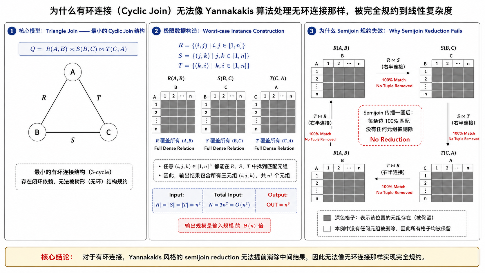

### 2.2.2 Yannak81 算法流程

Yannak81 使用两类核心对象来描述无环查询。

* **超图（Hypergraph）**：属性是顶点，关系模式是超边，超图用于描述"关系之间如何共享属性"；
* **连接树（Join Tree）**：以关系为节点构成一棵树，具有相同属性的关系节点需要保持连通，连接树用于描述"过滤沿什么路径传播"。

算法流程主要有三步：

**（1）判定无环性与连接树构造 (GYO)**

* 通过不断剥离超图中的"耳朵"（Ear）来验证无环性并构建连接树。
  * **耳朵定义**：一个超边 *R* 被称为"耳朵"，如果 *R* 中的每个属性要么不出现在其他任何超边中，要么被完全包含在另一条超边 *S* 中。

其基本过程如图 2.2 所示：

* 反复寻找满足"可安全删除"条件的超边；
* 若最终能够剥离到空图，则说明查询无环；
* 剥离顺序还能为后续连接树构造提供依据。

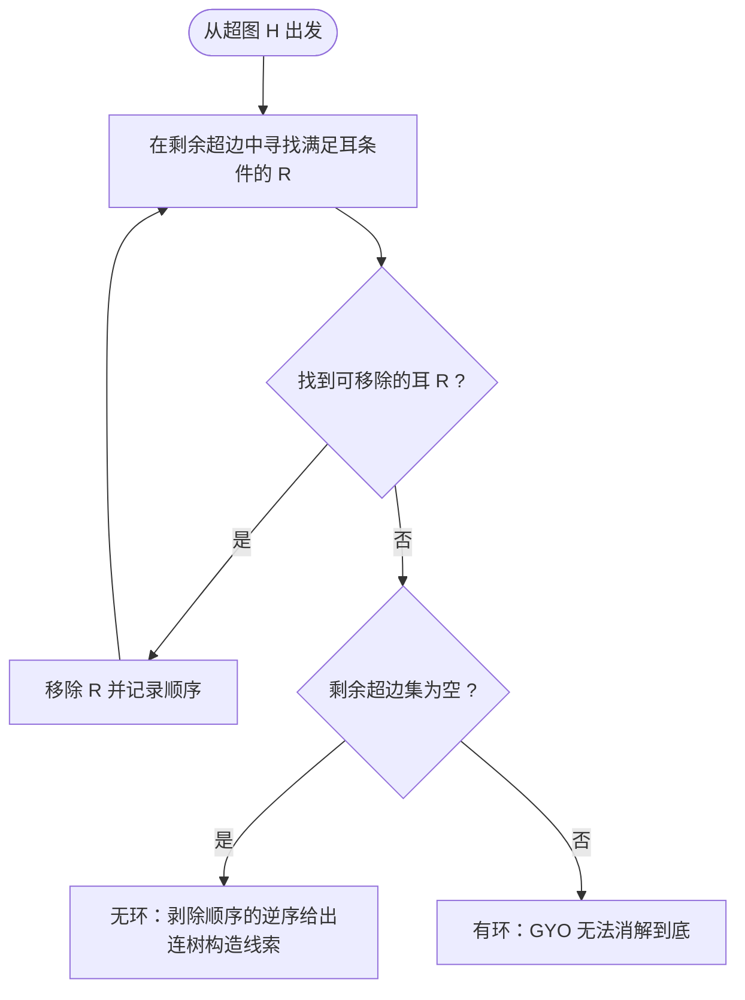
```mermaid
flowchart TD
  start([从超图 H 出发]) --> scan[在剩余超边中寻找满足耳条件的 R]
  scan --> found{找到可移除的耳 R ?}
  found -->|是| peel[移除 R 并记录顺序]
  peel --> scan
  found -->|否| empty{剩余超边集为空 ?}
  empty -->|是| ok["无环：剥除顺序的逆序给出连树构造线索"]
  empty -->|否| bad["有环：GYO 无法消解到底"]
```

图 2.2 GYO算法流程图

 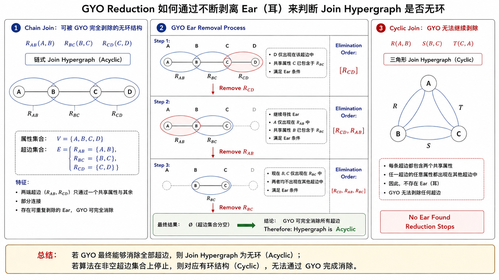

**（2）两遍半连接规约**

利用连接树 $T$ 执行以下操作：

1. **自底向上（Bottom-up）**：从叶子节点到根节点。每个父节点 $P$ 与其子节点 $C$ 执行 $P \leftarrow P \ltimes C$。这保证了父节点元组在子树中有匹配。
2. **自顶向下（Top-down）**：从根节点到叶子节点。每个子节点 $C$ 与其父节点 $P$ 执行 $C \leftarrow C \ltimes P$。这确保了约束扩散到全树。

无环性的真正价值，最终体现在一个更重要的性质上：**完全约简（Full Reduction）**。

直观来说：

> 若经过半连接传播后，一个关系中的某个元组仍然保留下来，那么它能够参与最终 Join 结果。

这意味着系统已经成功删除了所有"最终失败"的悬挂元组。

如图 2.4 所示，Yannakakis 证明：

* 对于无环查询，存在一套固定的"两遍半连接"传播过程，可以将任意实例约简到"无悬挂元组"状态；
* 而对于有环查询，不存在一套对所有实例都有效的通用半连接序列。

 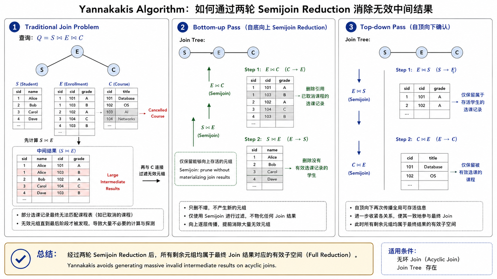

**（3）连接与输出 (Join Phase)**

* 在完成规约后，剩余的所有元组都是"有用的"。此时按照树的拓扑顺序执行正式连接，产生的中间结果大小严格受限。

### 2.2.3 Yannak81 算法讨论

对于"全输出"的自然连接查询，最终结果规模 $OUT$； 本身就是系统必须生成的数据量。因此，将整体复杂度控制在 $O(N+OUT)$ 是合理的。

但当查询包含**投影、聚合**等操作时，问题会进一步复杂化。无环性只约束了连接结构，但投影可能要求系统在内部保留更多中间信息，才能保证最终结果正确。因此，仅仅"无环"已经不足以保证最优复杂度，需要考虑输出属性在连接树上是否连通。满足"输出属性在连接树上连通"条件的无环查询可以保证在 $O(N+OUT)$ 实现全约简，否则为 $O(\min(N\cdot OUT,\, F))$。

另一方面，Yannak81算法在数据库系统的工程落地上存在诸多问题，例如：

* 如何降低半连接传播的常数开销；
* 如何兼容向量化与流水线执行。

这些问题在后续的 Yannak+（见2.3节）、PT（见2.4节）、RPT（见2.5节）、RPT+（见2.6节）和SQL Srv（见2.7节）给出了解决方案。

## 2.3 工程化落地实践——Yannak+

> **核心点**：Yannak+从算法上改进了Yannak81，并通过算子重排显著降低了常数开销，提升了执⾏效率。在工程实践上，Yannak+⽣成由标准关系算⼦构成的传统有向⽆环图 （DAG）查询计划，可集成⾄其他标准SQL引擎中。

"理论存在最优路径"并不等于"工程上默认执行"，Yannak81存在较⼤的隐藏常数因⼦导致了工程化落地的的难度。

### 2.3.1 Yannak+算法改进点

Yannak+核心算法的改进表现在三个方面：

**（1）针对⽆环查询，保留了与原始Yannakakis算法完全⼀致的理论保证，并给出了不同查询类别的时间复杂度**

Yannak+将无环联合查询分为三个拓扑⼦类：

* ⽆环联合查询(Acyclic CQs)：可通过GYO消解算法规约为⼀棵连接树（Join Tree）的查询。树中节点与物理表对应，且包含任⼀特定列属性的节点必须构成连通⼦树。
* ⾃由连通联合查询(Free-connex CQs)：无环联合查询的特例。若连接树中存在一个包含根节点的连通子树，且该子树覆盖所有输出属性，同时子树内非根节点与父节点连接的公共键完全属于输出属性集，则为Free-connex查询，可实现 $O ( N + OUT )$ 的复杂度。
* 关系主导联合查询(Relation-dominated CQs)：无环联合查询的特例。存在一个主导表，其自身的数据列已包含查询所需的全部输出属性，可实现 $O ( N )$ 的复杂度。
* 一般⽆环联合查询：除去Free-connex CQs、Relation-dominated CQs之外的无环联合查询，可确保最坏情况时间复杂度为 $O(\min(N\cdot OUT,\, F))$

**（2）将"全局规约"改为"按需规约"**

Yannak81 包含两遍半连接与一轮连接，而 Yannak+ 通过算⼦重排将查询计划改进为一轮自底向上的半连接和一轮自顶向下的连接。

第⼀轮自底向上的半连接对连接树进⾏后序遍历。其核⼼逻辑是在执⾏半连接消除悬挂元组之前，尽可能提前执⾏聚合操作以缩减数据量。

当遍历到节点 $R _ { i }$ 时：

* 若 $R _ { i }$ 为叶⼦节点，且其特有属性中没有⼀个是最终输出属性，系统会提前进⾏聚合，去除这些⾮核⼼属性，⽣成轻量中间视图，并直接与其⽗节点 $R _ { p }$ 进⾏连接。随后 $R _ { i }$ 从树中移除。
* 若 $R _ { i }$ 包含输出属性或为⾮叶⼦节点，系统通过投影剔除冗余数据列，并通知⽗节点 $R _ { p }$ 执⾏半连接 $( R _ { p } \ltimes R _ { i } )$ ，以过滤悬挂元组。

通过这⼀轮操作，系统在 $O ( N )$ 时间复杂度内完成了初步的数据压缩与过滤。

对于Relation-dominated CQs，第⼀轮执⾏完毕后，查询树可直接合并为单⼀结果表，耗时$O ( N )$ ，⽆需执⾏后续步骤。

图 2.5 给出了传统计划执行方式和Yannak+提前聚合对比的示例。

 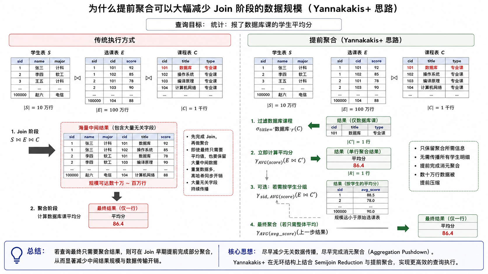

若第一轮无法完全折叠查询结构，则第二轮才会对关键连接步骤补充必要的规约与受控连接。

为此，论文引入了两个关键状态：

* **悬挂自由（Dangling-free）**：若中间表内的每⼀个元组在全局全连接结果集中都能找到匹配项，则该表为悬挂⾃由。经过第⼀轮处理，剩余连接树的根节点必然是悬挂⾃由的。
* **可约简（Reducible）**：若相邻节点表和 $R _ { j }$ 之间除了最终输出属性外，不存在私有连接键，则对 $R _ { j }$ 是可约简的。

采⽤贪⼼合并策略，寻找处于"悬挂⾃由"状态的核⼼表及其"可约简"邻接表进⾏物理连接，并用输出属性投影，将其合并为⼀个新节点。该过程的数据量膨胀被限制在$O(\min(N\cdot OUT,\, F))$ 范围内。

对于Free-connex CQs，连续触发Algorithm 2可以在 $O ( OUT)$ 时间内完成剩余合并，最终达成 $O(N+OUT)$的复杂度。

对于⼀般⽆环查询，当找不到可约简关系时，系统会插⼊少量半连接将数据局部转化为悬挂⾃由状态以继续合并，确保最坏情况时间复杂度为 $O(\min(N\cdot OUT,\, F))$。

**（3）⽀持复杂业务场景的扩展**

⾯ 对 包 含 闭 环 关 联 的 有 环 查 询 ， Yannak+ 结 合 了 ⼴ 义 超 树 分 解（Generalized Hypertree Decomposition，GHD）。GHD将形成闭环的物理表在逻辑上打包为"超级容纳包（Bag）"节点。系统优先对每个包内部的有环结构进⾏求解，将其固化为视图。由于包与包之间的结构构成⽆环⼴义连接树，随后可使⽤Yannak+算法进⾏全局调度评估。图2.6展示了由GHD生成的⽆环⼴义连接树。

针对标量⼦查询，Yannak+将其视为独⽴的逻辑单元，率先求值并视为输⼊表，将嵌套查询转化为扁平化的⽆环联合查询。针对差集运算（Difference of Conjunctive Queries，DCQ），系统通过代数重写引擎将差集指令下推⾄局部连接层级优先执⾏，避免了全局全连接结果的集合相减，确保了 $O ( N + OUT )$ 的执⾏时间 。此外，系统⽀持下推集成Top-k评估以控制计算量。

 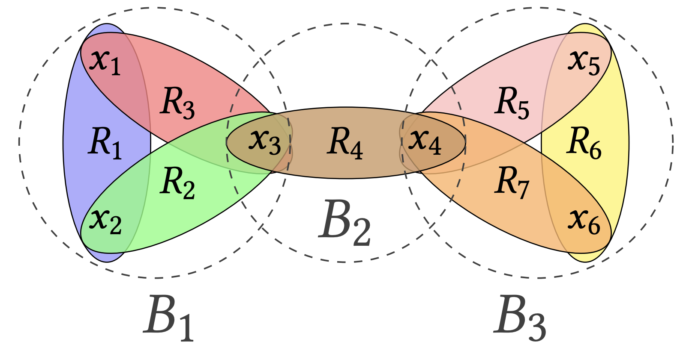

### 2.3.2 Yannak+查询优化器设计

由于Yannak+可能⽣成多棵等效的⽆环连接树，且规约顺序存在组合空间，虽然理论时间复杂度⼀致，但实际执⾏耗时受常数因⼦影响差异较⼤。因此，研究团队专⻔设计了相应的查询优化器。

**（1）基于规则的优化(Rule-Based Optimization,RBO)**

RBO引擎包含多项代数重写规则：

- 主键约束去环（Cycle Elimination）：识别由主键-外键（PK-FK）约束引起的伪拓扑环路，通过变量重命名技术将其剪断，还原⽆环结构。
- 冗余聚合消除（Aggregation Elimination）：若分组投影键包含表的唯⼀约束（如主键），系统会移除该处⽆实质缩减作⽤的聚合算⼦。
- 半连接消除（Semi-join Elimination）：当⼦节点⽤于连接的键是其主键，且未附加选择过滤谓词时，基于参照完整性，可省略⽗表针对该⼦表的半连接探测。
- 标注列裁剪（Pruning for Annotation）：精准切断不参与半环计算的维度表上的标注衍⽣列，降低列式数据库的内存扫描压⼒。
- 维度表融合（Fusion of Dimension Relations）：在星型模型中，优先让微⼩维度表进⾏笛卡尔积融合，再与⼤表进⾏碰撞，减少与⼤表的重复半连接操作。

**（2）基于代价的优化(Cost-Based Optimization, CBO)**

CBO调度器通过GYO或GHD算法枚举候选连接树，并应⽤裁剪规则缩减搜索空间：

* 包含输出属性的节点在拓扑排序中需尽量靠近树根。
* 较⼤的事实表优先置于树的⾼层位置。
* 倾向于⽣成⾼度并⾏压缩的"浓密树（Bushy plans）"结构，以缩短叶⼦节点向主⼲传输数据的路径。

随后，CBO利⽤直⽅图等基数估计技术（CE）为候选路径评估代价。得益于Yannak+的渐近理论保证，即便基数估计出现偏差，其最坏情况性能仍受到数学限制，因此对估计错误具有较⾼的容错性（Robustness）。

Yannak+的系统架构如图2.7所示。

 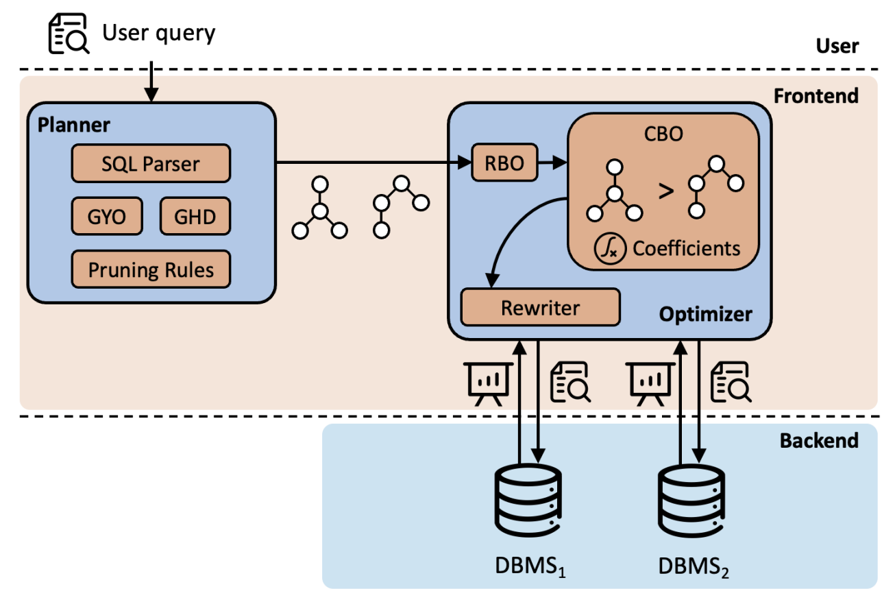

Yannak+规定其执行计划仅由四种标准关系算子构成，算子定义及理论复杂度详见表 2.2。

**表 2.2：标准算子与 SQL 模板**

| 算子               | SQL 查询                                                           | 复杂度                          |
| ------------------ | ------------------------------------------------------------------ | ------------------------------- |
| Selection(σf(R))  | SELECT\* FROM R WHERE f;                                           | O(\|R\|)                        |
| Projection(πE(R)) | SELECT E, ⊕(v) AS v FROM R GROUP BY E;                            | O(\|R\|)                        |
| Join(R1 ≫ R2)     | SELECT\*, R1.v⊗R2.v AS v FROM R1 NATURAL JOIN R2;                 | O(\|R1\| + \|R2\| + \|R1⊗R2\|) |
| SemiJoin(R1 ≫ R2) | SELECT\* FROM R1 WHERE R1.key in (SELECT DISTINCT R2.key FROM R2); | O(\|R1\| + \|R2\|)              |

### 2.3.3 Yannak+落地实践：Quorion

如图所示，Quorion系统包含四个主要组成部分：基于 Web 的界面、解析器与规划器、优化器（CBO 与 RBO）以及重写器。

**（1）前端解析与规划**

系统拦截输入的SQL语句，使用Apache Calcite解析器将 SQL 查询转换为逻辑计划，再转换为关系超图。若查询为循环的，则采用 GHD 算法；若为无环的，则使用 GYO 算法生成候选连接树。连接树生成后，在其上附加聚合与投影等额外查询信息。所得计划再送往优化器进行基于代价与基于规则的优化。

**（2）查询优化**

优化器依据连接树的结构与各类统计量（如各节点上的基数与不同值个数（NDV））评估不同连接顺序的代价。这些统计量由 DBMS 提供。对于需要较长优化时间的复杂查询，Quorion允许跳过规划与优化步骤，使用 DBMS 提供的连接树进入后续重写阶段。这有助于在优化时间与查询执行时间之间取得权衡。

**（3）中间表示(IRs)**

收到连接树后，Quorion使用 Yannak+ 算法将这些树转换为一系列等价的 IRs。

**（3）方言转换与下推执行**

系统将 IRs 转换为目标数据库支持的SQL脚本或临时视图落盘语句，随后交由底层的DuckDB、PostgreSQL、SparkSQL或AnalyticDB执行。

 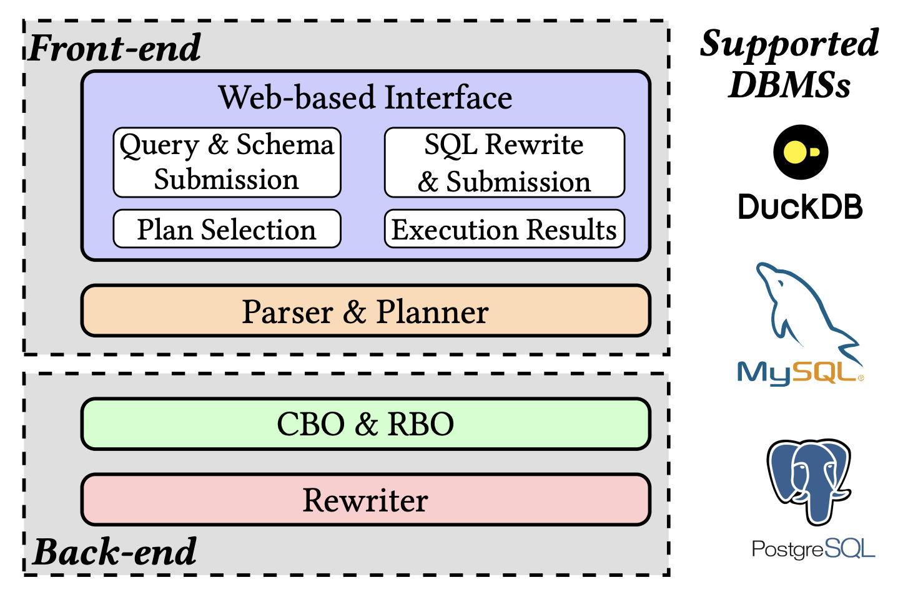

### 2.3.4 实验评估

实验涵盖了SGPB图数据基准、LSQB社交网络基准、TPC-H(Scale Factor 100)数据仓库测试及JOB(IMDB)数据集，总计162个复杂查询。

**（1）整体加速⽐与表现**

 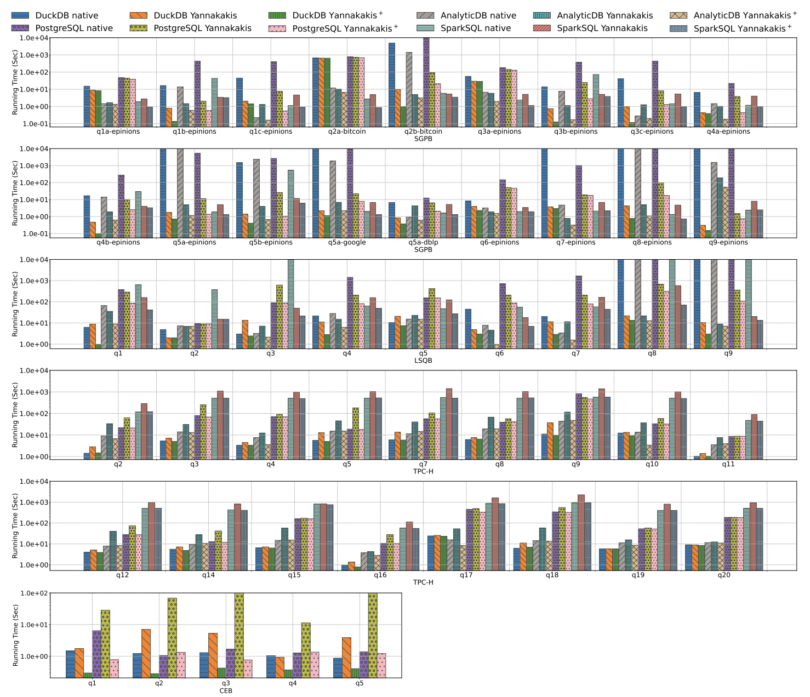

在162个测试查询中，Yannak+在160个查询中优于各数据库的原⽣执⾏计划。平均加速⽐达到2.41倍，最⼤加速⽐为47,059倍。与原始Yannakakis算法相⽐，Yannak+的平均加速⽐为2.74倍，最⼤加速⽐为156倍。

- SGPB（图数据分析）：在DuckDB上，对原⽣执⾏计划获得了平均194倍、最⾼47,059倍的加速；在AnalyticDB上最⾼加速6,606倍。
- LSQB（社交⽹络查询）：在Scale Factor 30下，多个引擎原⽣计划因内存不⾜超时，⽽Yannak+通过早期聚合平滑完成运算，在DuckDB上最⾼提速2,391倍。

**（2）JOB数据集表现**

 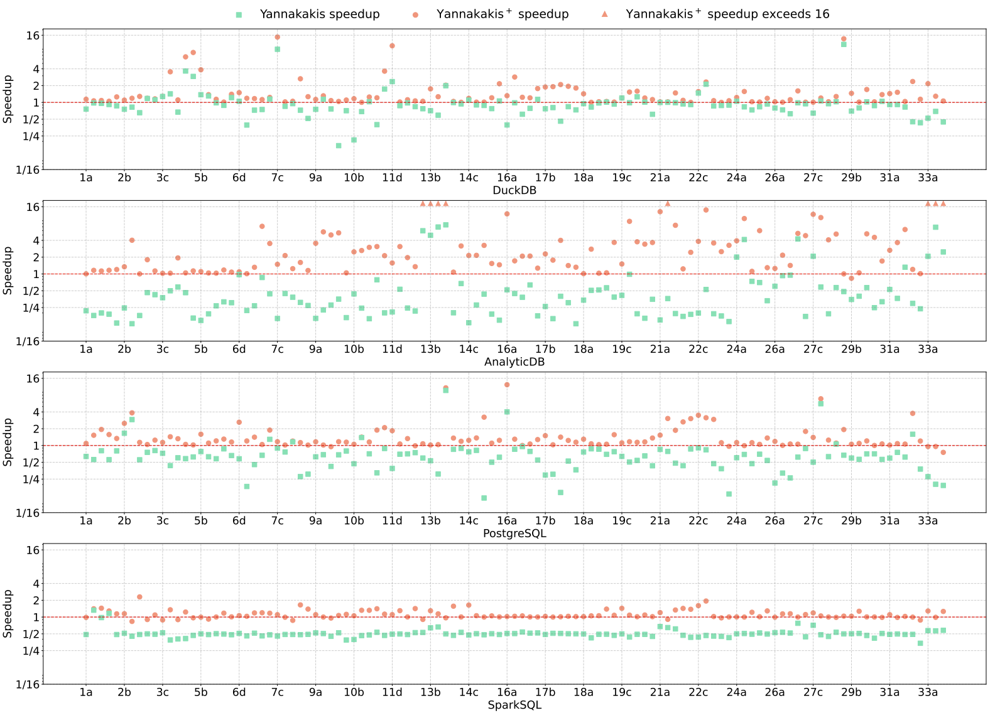

JOB数据集包含⼤量规律的主键-外键（PK-FK）约束。原始Yannakakis算法在此类数据集上表现通常不如原⽣计划。Yannak+通过Algorithm 1的聚合下推与RBO的半连接消除，降低了框架开销。在DuckDB上取得了最⾼14.84倍、平均1.42倍的加速；在AnalyticDB上最⾼加速94.50倍，平均2.71倍。

**（3）消融实验分析**

- RBO层⾯：在未开启RBO优化时，针对某些JOB查询耗时较⾼。激活"主键防环消除"与"标注裁剪"规则后，运⾏时间从29.68秒降⾄3.59秒，优于DuckDB原⽣优化的4.36秒。
- CBO层⾯：当输⼊精确基数时，系统规划出最优路径；当输⼊估算基数时，Yannak+仍能保持优于原⽣计划的表现。但如果强⾏采⽤最坏情况物理假设（Worst-case bounds）评估代价，系统性能会有所下降。

**（4）鲁棒性与开销分析**

- 选择性影响：放宽选择过滤条件导致输出结果集变⼤时，由于Yannak+进⾏了早期剪枝，其相对原⽣查询的加速优势呈现出明显的放⼤趋势。
- 规模伸缩性：在数据量扩容⾄50倍时，Yannak+的耗时呈现出稳定的线性平滑增⻓。
- 并⾏度测试：由于输出指令遵循标准并⾏SQL规范，Yannak+在多线程并⾏加速⽅⾯表现良好，其并⾏加速曲线与底层原⽣数据库相似。
- 优化器开销：在⼤部分复杂案例中，Yannak+的前置决策⽣成计划时间基本控制在100毫秒（0.1s）以内。

### 2.3.5 算法讨论

Yannak+ 的"算法改造"做了两件事：

* 在自底向上的半连接中提前进行聚合和投影，将能被消元的叶子就地消元。
* 将自顶向下的半连接和连接阶段结合起来，只做必须做的"成员性约束"，当结构不允许直接受控连接时，才在局部发起一次单向半连接，把某个子关系强制推到"无悬挂"（每行都有至少一个匹配）的状态，再继续做"受控连接 + 投影"。

在改造后的算法中，Yannak+仅在需要的时候用局部半连接规约把后续连接限制在安全体积内，减少了半连接次数与物化点。对于Relation-dominated CQs，Yannak+只进行一次自底向上的半连接就可以在O(N)中完全约简。

但为适配现有 DBMS，Yannak+付出了一些解析和调度的成本：

* SQL→逻辑计划→关系超图→IR→目标方言的链式变换及方言差异带来的重写成本；
* 对编译期与运行期边界上的多语句拆分、临时视图与 SQL/视图下推顺序、物化点的调度成本。

Yannak+中提到其采⽤的半连接操作是"柔性"的，允许保留少量悬挂元组，可使⽤Bloom Filter实现该操作，其效率远⾼于现有半连接算⼦。用Bloom Filter实现半连接这一想法在前一年的PT中就已经实现了（见2.4节）。

## 2.4  工程化落地实践——PT

> **核心点**：PT算法将局部谓词转化为可沿 Join 图多跳传播的 Bloom Filter，通过中间表完成键域转译，在可控假阳性的前提下提前过滤输入的大表。实验中，PT 在 TPC-H 基准上相对 Bloom Join 平均获得约 $3.3\times$ 加速。

PT 用谓词传递有向无环图代替Yannak81 中的连接树，但由此不提供 Yannak81 $O(N+OUT)$的理论保证。在含环、深链路、多表 Join 等更一般的查询结构中，PT往往能以更低成本获得有效预过滤。

PT 研究团队发现Bloom Filter能够实现与半连接近乎等效但代价低得多的预过滤效果，代价是存在少量假阳性，即有些本该被过滤的元组仍会留下。图 2.11给出了Yannak81精确半连接过程中的传统物化流程与PT谓词传递之间的对比。

 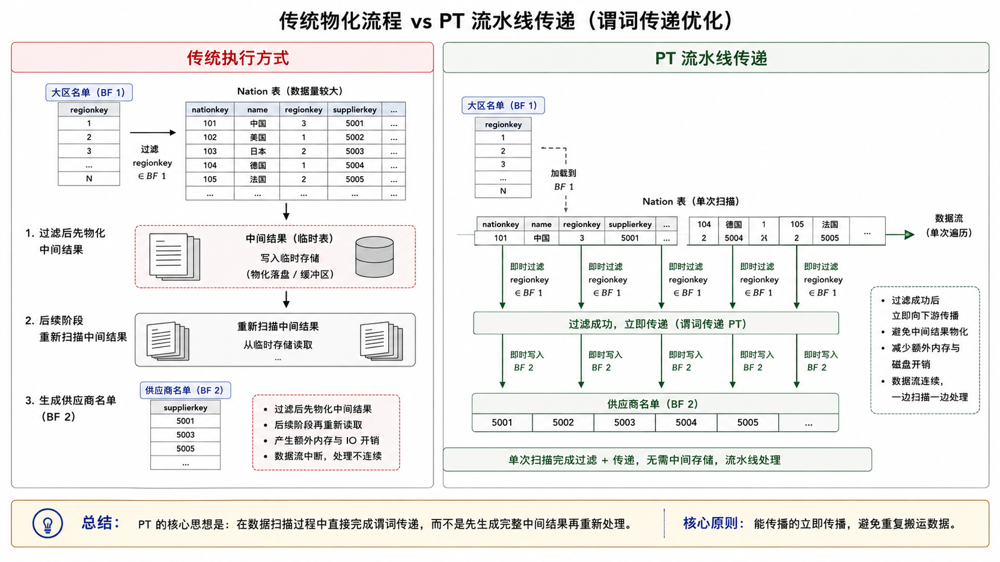

### 2.4.1 PT 算法流程

PT 的执行过程可以分为两个阶段：第一阶段进行谓词传递，第二阶段在预过滤后的输入上执行常规 Join。

（1）**谓词传递阶段**

对应Yannak81的两遍半连接。PT根据"小表优先"的启发式规则生成一张谓词传递有向无环图来替代Yannak81中的GYO连接树构造算法，进行对称的两遍Bloom Filter半连接。PT 尽量保留 Join 图中的等值连接边，并通过前后两遍遍历让过滤信号在图中传播。谓词传递有向无环图示例见图 2.12*。*

对于一个中间表，如果它有多个入站 Bloom Filter，系统可以在同一次扫描中完成多路探测、本地谓词过滤以及出站 Bloom Filter 构建，从而避免反复扫描同一张表。其中的关键操作是**键域转译**。多跳传播时，上一跳过滤的可能是属性 $A$ ，下一跳连接使用的却可能是属性 $C$。PT 将中间表视为"转译站"：扫描中间表时，先用入站键探测 Bloom Filter，保留通过过滤的行，再把这些行对应的出站键插入新的 Bloom Filter，具体示例见图 2.13。这样，远端谓词就能沿着不同 Join Key 逐步传递。

（2）**连接阶段**

系统基于已经预筛后的输入执行常规 Join。此时失败的探测项已经在前置传播阶段被过滤，Join 阶段的构建、探测和物化开销都会下降。用更便宜的近似过滤，换取整体 Join 输入的提前缩小。TPC-H Q5 是一个典型例子。region、nation 等维表上的过滤条件距离 lineitem 较远，单跳 Bloom Join 很难在 Join 开始前触达事实表；而 PT 可以让约束沿 region → nation → supplier/customer → orders/lineitem 等路径逐步传播，使大表在进入 Join 前就被明显压缩。

 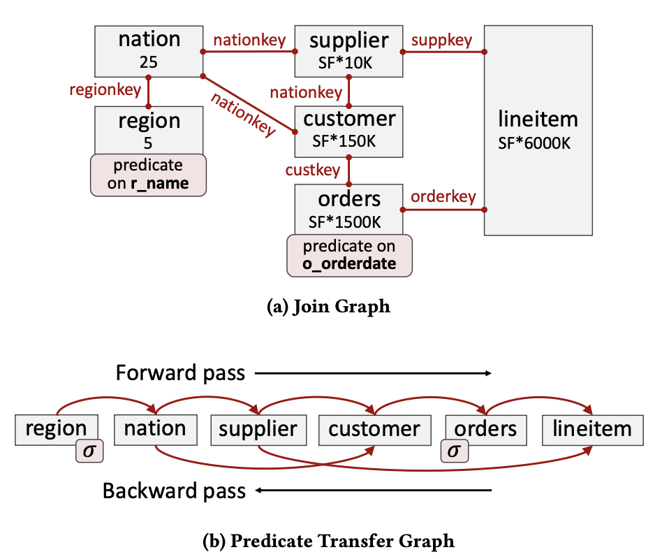

 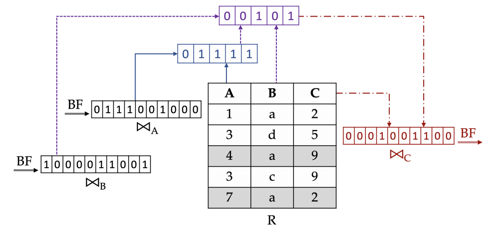

### 2.4.2 实验评估

实验基于 FlexPushdownDB 完成，数据以 Parquet 存放，并通过二次运行观察内存热路径下的表现。

如图 2.14 所示，PT在 Q5 上：Join 阶段在 SF=1 与 SF=10 下分别达到约 $44\times$ 和 $60\times$ 加速；传播阶段相比 Yannakakis 的半连接阶段，分别快约 $13\times$ 和 $16\times$。

 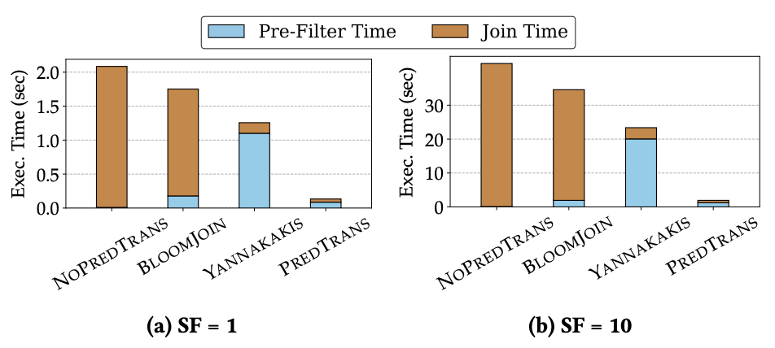

如表2.2所示，既定 Join 顺序下，PredTrans 相比 NoPredTrans 缩减连接表规模 98%，相比 BloomJoin 缩减 96%，相比 Yannak81 缩减 64%。这一结果说明，PT 的关键收益来自把过滤传播从"昂贵前置"改成"便宜前置"。

 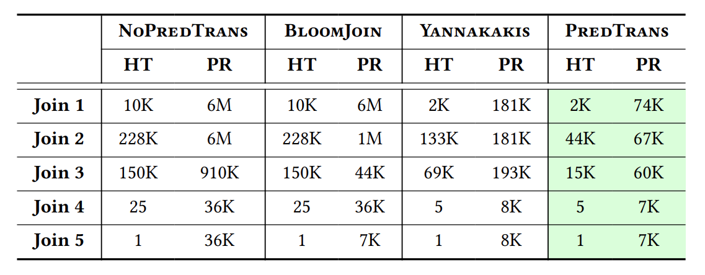

Q5 的强选择性谓词位于远端维表，而大事实表 lineitem 处在较深位置。没有多跳传播时，谓词会先收缩局部维表，此时大事实表携带大量候选行进入 Join；有多跳传播时，PT 把远端谓词转译为作用于事实表 Join Key 的过滤条件，使大表在进入 Join 前就被压缩。相比之下，单跳 Bloom Join 只能在相邻 Join 发生后逐步产生过滤效果，无法在整段 Join 开始前完成全局预过滤。

当谓词本身选择性较弱，或者 Join 图结构使传播难以形成强约束时，收益会下降。如图 2.15 所示，Q17 在较大规模下可能由大表分组聚合主导，预过滤对总时间的影响会被稀释；Q21 则因为 Join 数量多、假阳性链式累积明显，导致相对 Bloom Join 的加速收窄。

 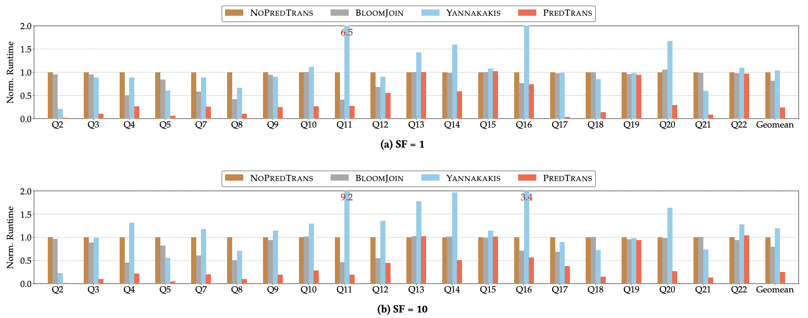

如图 2.16 所示，通过 Join 顺序敏感性评估了 PT 的鲁棒性。在不同 Join 顺序下，PT 的整体性能波动约在 12% 以内。由于 Join 输入已经被提前压缩，中间结果膨胀空间变小，后续 Join 顺序对总体性能的影响也会下降。

 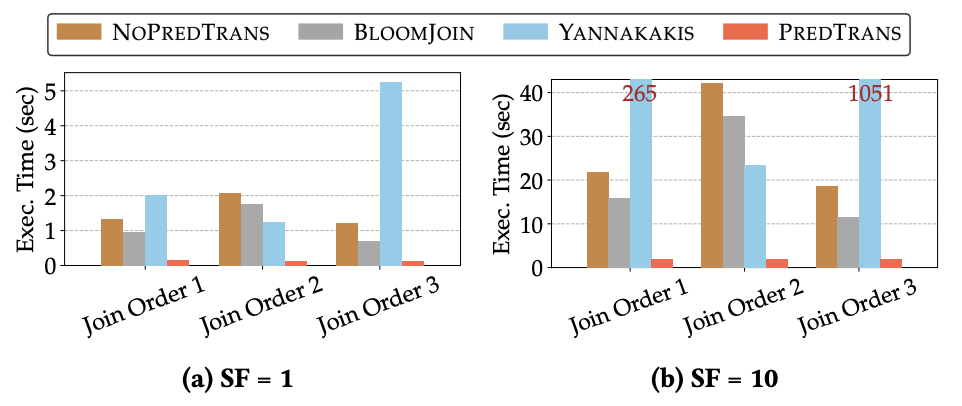

Yannak81 的半连接阶段受连接树构造影响较大，整体时间仍可能对连接树选择敏感；PT 的谓词传递有向无环图由"小表到大表"的启发式定向和两遍传播决定，把顺序敏感性压缩到已经变小的 Join 残量上。

### 2.4.3 算法讨论

PT用近似谓词传播替代精确半连接，将局部谓词的选择性沿 Join 图多跳传递到更深处的大表。PT用 Bloom Filter 将前置过滤的主要成本压缩为顺序扫描和位运算。对于 Join 图较大、谓词分散、强选择性条件远离事实表的查询，这种方法往往比单跳 Bloom Join 更容易获得端到端收益。但PT存在下列可优化的点：

* 传播效果依赖谓词传递有向无环图定向与遍历顺序；
* 外连接、破坏 Join Key 的聚合或函数会阻断谓词传播；
* 在宽图或多跳场景中，Bloom Filter的假阳性可能累积，导致 Join 阶段残留开销增大。

从工程化的角度看，PT 把"跨多表的可匹配性约束"显式化为一段前置过滤计划，再与后续 Join 计划拼接执行，让优化器在更小的输入上继续工作。

要在PT近似传播的基础上获得类似 Yannak81 的结构性兜底，需要更强的鲁棒机制。后续的 **Robust Predicate Transfer（RPT）**正是沿着这一想法展开。（👉 见 2.5 节）。

## 2.5 工程化落地实践——RPT

> **核心点**：RPT 结合了 Yannak81 的全约简思想和 PT 的轻量级 Bloom Filter 传播机制，在无环查询场景下显著降低查询性能对 Join Order 的依赖，使随机 Join Order 的最坏性能接近最优计划，实验中最坏约为 $1.6\times$。

查询优化器依赖 Join Order 选择，但：多表连接中的基数估计误差容易随 Join 数量增加而放大；Join Order 的搜索空间很大，复杂查询往往只能依赖启发式搜索。优化器可能选出"先膨胀、后过滤"的执行路径。

PT 已经证明，用 Bloom Filter 传播谓词可以显著降低前置过滤成本。但 PT 主要依赖启发式定向的谓词传递有向无环图，过滤信号可能无法覆盖完整查询图，导致 Join 阶段仍保留较多悬挂元组，性能依旧受 Join Order 影响。RPT 通过限定连接树的结构实现全约简，延续PT的做法，将Bloom Filter 作为轻量传播载体，并提供鲁棒性保证：一个无环查询的运⾏时代价与最优代价的⽐值不超过⼀个常数因⼦。

 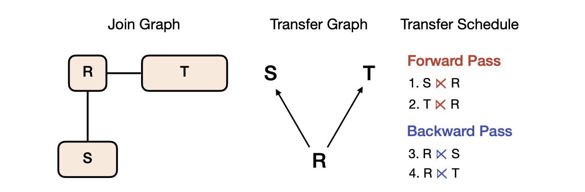

### 2.5.1 RPT 算法流程

Yannak81 包含两遍半连接与一轮连接两个阶段。对应地，RPT也将查询执行分为两阶段：Transfer 阶段和Join阶段。其中 Transfer 阶段给出两遍半连接的逻辑顺序，由两个子算法完成：LargestRoot算法让谓词传播尽量完整，SafeSubjoin算法限制 Join 阶段产生不安全的中间结果。

**（1）LargestRoot 算法**

对于无环查询，论文将 Join 图 的边权定义为两个关系共享属性的数量，并理论证明该加权图上的最大生成树为连接树。RPT 使用 Prim 算法构造最大生成树，并选择最大的关系作为根节点。在最大生成树构造过程中，如边权值相同，则大表优先。传播方向自底向上从叶子指向根，即前向过滤（forward pass）的顺序。

**（2）SafeSubjoin 算法**

仅使用LargestRoot 算法在 Transfer 阶段完成过滤，如果 Join 阶段随意选择顺序，仍可能生成较大的中间结果，如图 2.18 所示。SafeSubjoin 算法的判断是：对于一个已经全约简的实例，如果某个子连接结果等于最终结果在对应属性集合上的投影，那么这个子连接就是安全的，因为它的规模不会超过最终输出规模。若一个 Join Order 的每一步都满足这种安全性，累计中间结果就能被控制在输出规模的常数倍范围内。

 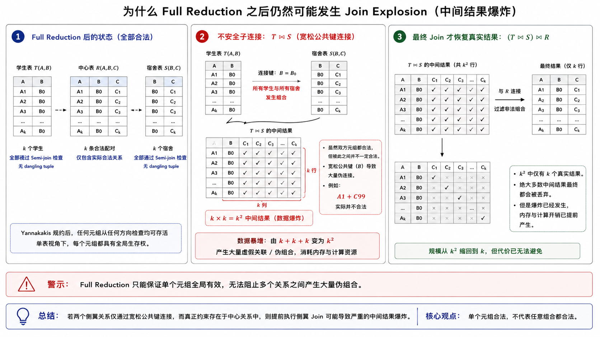

### 2.5.2 RPT工程化设计

以 DuckDB 为例，系统可以在优化器阶段加入 RPT 模块，⽤于将 LogicalCreateBF和LogicalProbeBF算⼦插⼊查询计划。

RPT 模块先从逻辑计划中构造 Join 图，再运行 LargestRoot和SafeSubjoin  生成 Forward 和 Backward 的两遍半连接。对于传递调度中的每个半连接 $R \ltimes S$ ，为关系$S$插⼊ LogicalCreateBF算⼦，并为关系$R$插⼊使⽤$S$构建Bloom Filter的 LogicalProbeBF算⼦。这些逻辑算⼦随后在物理计划⽣成器中被替换为 CreateBF和ProbeBF物理算⼦。CreateBF 负责根据当前关系的 Join Key 构造 Bloom Filter，ProbeBF 则以向量化方式探测 Bloom Filter。

RPT实现了⾼效的位向量到Selection Vector的转换，用Bloom Filter探测返回的位向量更新 DuckDB中用于标记数据块中的有效条⽬的Selection Vector，从而在流水线中完成预过滤。

以JOB 3a的查询计划为例，图 2.19 展示了插⼊CreateBF和ProbeBF后的物理计划。图中⿊⾊实线表示数据块的流向（⾃下⽽上），红⾊/蓝⾊虚线箭头表示Bloom Filter的传递（通过共享内存）。每个CreateBF⾸先作为汇算⼦，在流⽔线末端缓存数据块并创建Bloom Filter；随后作为下⼀个流⽔线的源算⼦，将缓存的数据块提供给后续算⼦ （如ProbeBF和哈希连接）。

 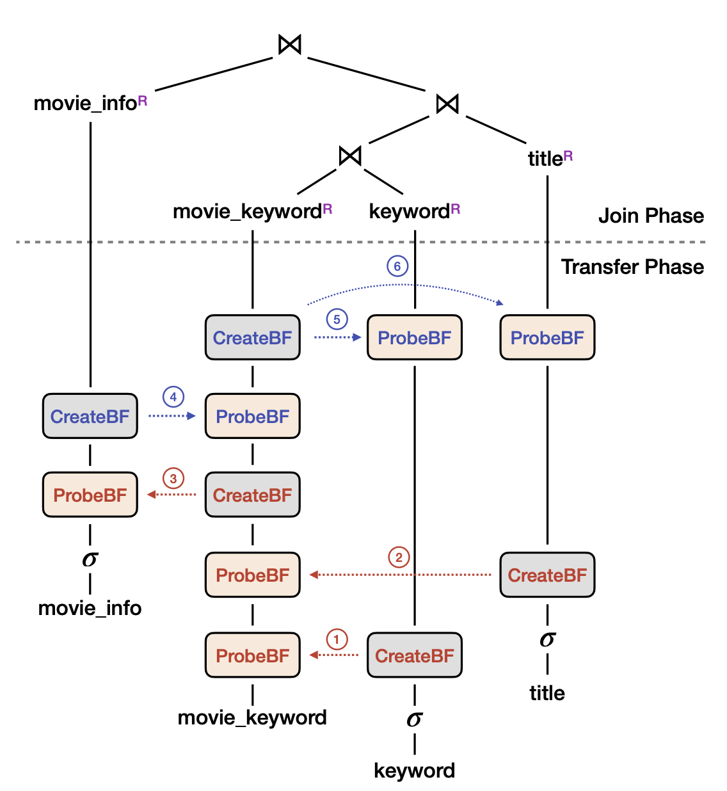

### 2.5.3 实验评估

RPT 对每条查询生成多组随机 left-deep 和 random bushy 计划，比较不同计划下的执行时间分布，并使用 Robustness Factor（RF，即最慢时间 / 最快时间）衡量波动。这个指标关注的不是平均性能是否提升，而是最坏计划是否会明显失控。图 2.20展示了每个查询在随机左深计划下的端到端执⾏时间分布。实验结果表明，集成RPT后，DuckDB对所有⽆环查询均展现出优异的连接顺序鲁棒性。

 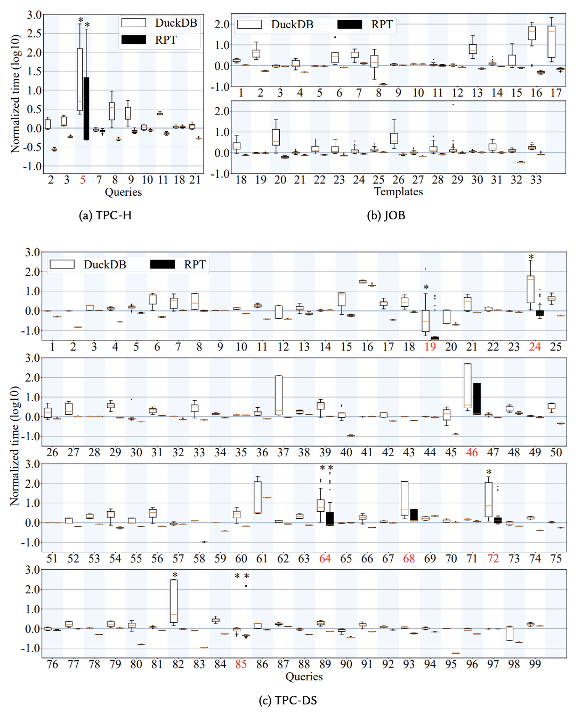

为量化连接顺序鲁棒性，定义鲁棒性因⼦（RF）为最⼤执⾏时间与最⼩执⾏时间的⽐值，表2.4列出了两种⽅案在各基准测试集中的鲁棒性因⼦平均值、最⼩值和最⼤值。如表2.4 所示，在 TPC-H、JOB、TPC-DS 上，RPT 的平均 RF 接近 1，最大 RF 也大致控制在 1.5 到 1.6 之间。相比之下，DuckDB的 RF 可达到 9.3（TPC-H）、371（JOB）和 224（TPC-DS）。这说明，RPT 能够显著压缩不同 Join Order 之间的性能差距。

表 2.4 左深连接的鲁棒性因子

 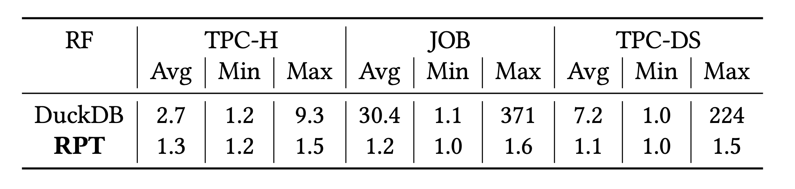

如表 2.5 所示，RPT 相对 DuckDB 默认计划的端到端几何均值加速约为 $1.5\times$。相比之下，PT 由于定能完成全约简，在部分负载上仍然会残留对 Join Order 的敏感性。

表 2.5 相较于DuckDB（优化器原生执行计划）的平均加速比

 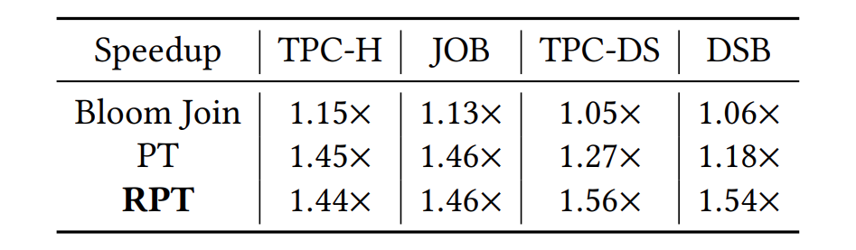

当计划空间扩展到 random bushy 时，RPT 仍能保持较好的鲁棒性，但少数查询的波动会略有上升。如图 2.21 所示， 采⽤丛状计划时，RPT对随机连接顺序的鲁棒性与左深计划相近：平均鲁棒性因⼦$RF<1.8$，最差情况为JOB的Query 17e（鲁棒性因⼦ $RF=7.7$）。部分查询（如TPC-H Q7、JOB 16b和17e）从左深计划切换为丛状计划后，鲁棒性略有下降，其共同原因是：在最差的随机丛状计划中，优化器错误地将较⼤的表置于哈希连接的构建端。

 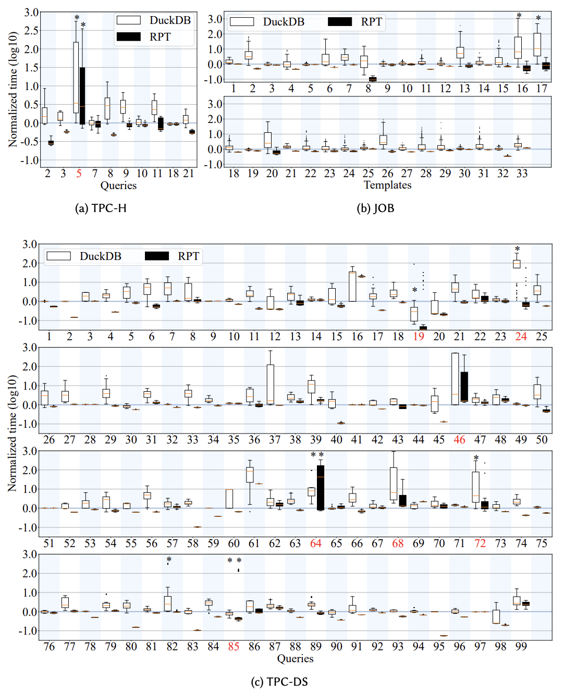

RPT传递阶段的半连接约简降低了探索更⼤计划枚举空间的收益。如图 2.22 所示，RPT的连接阶段采⽤丛状计划时，TPC-H和JOB的端到端执⾏时间仅较左深计划分别提升6%和11%；尽管优化器⽣成的计划略慢于随机⽣成的最优计划，但丛状计划带来的相对性能增益仍较⼩（TPC-H为10%，JOB为 5%）。

 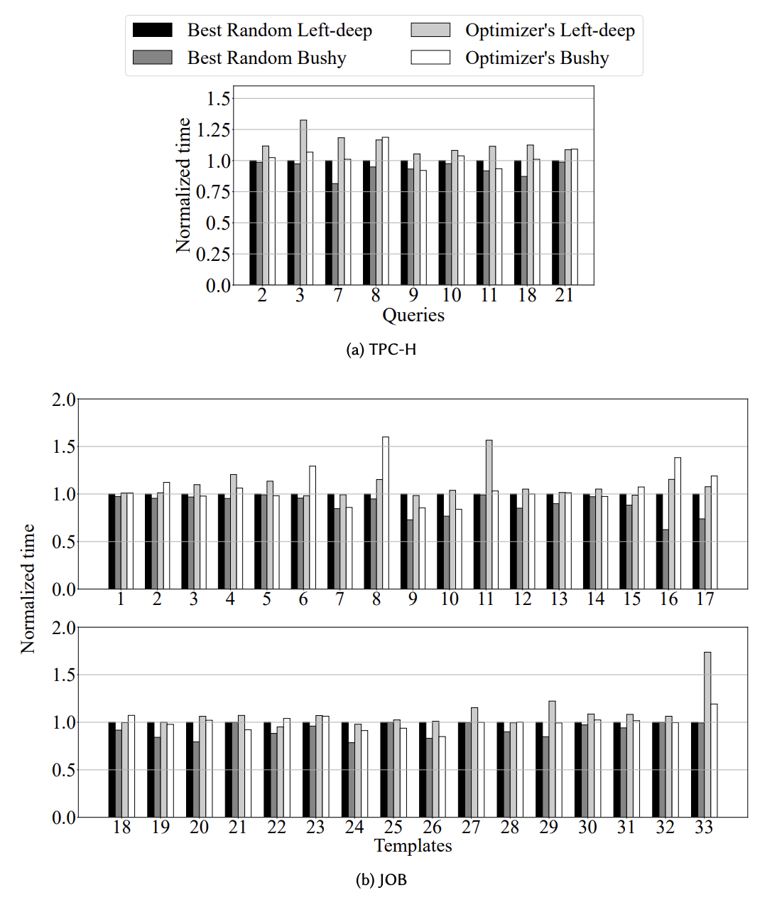

从中间结果规模看，RPT 的效果更直观。如图 2.23 所示，没有 RPT 时，某些查询的最坏 Join Order 会生成约 $179\times$ 的中间元组量；加入 RPT 后，最坏与最好之间的累计中间结果比值可降到约 $1.2\times$。

 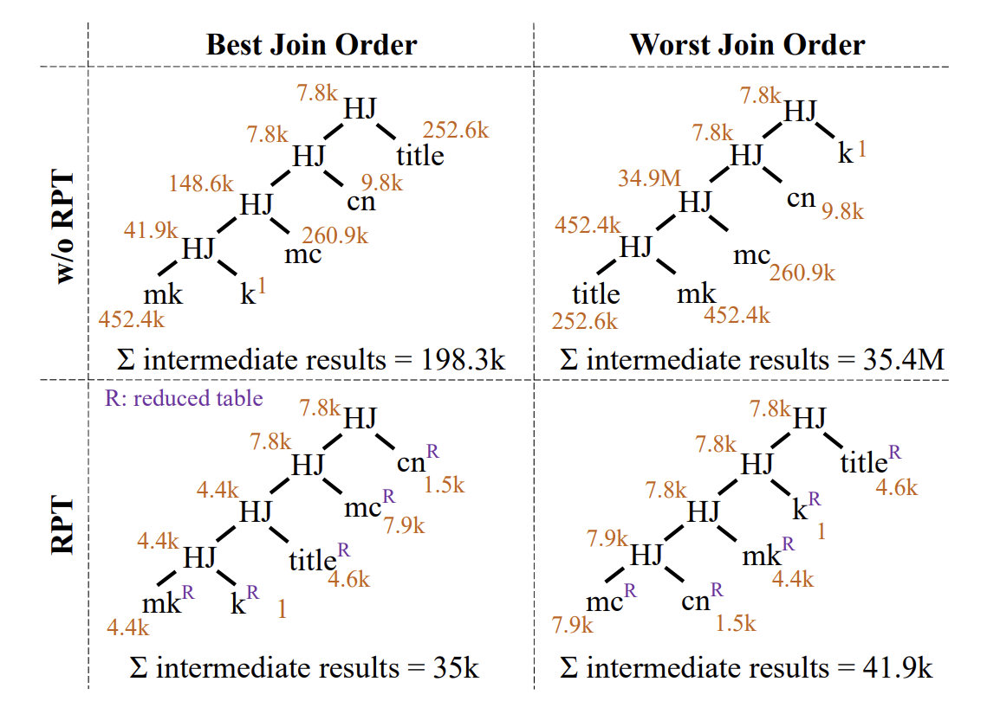

对于输出为空的查询，在没有强过滤的情况下，执行过程仍可能被迫处理中间规模为 $N^2/2$ 的结果，如图 2.24 所示；而 RPT 的 Transfer 阶段可以在 Join 前消除这类无效扩张。

 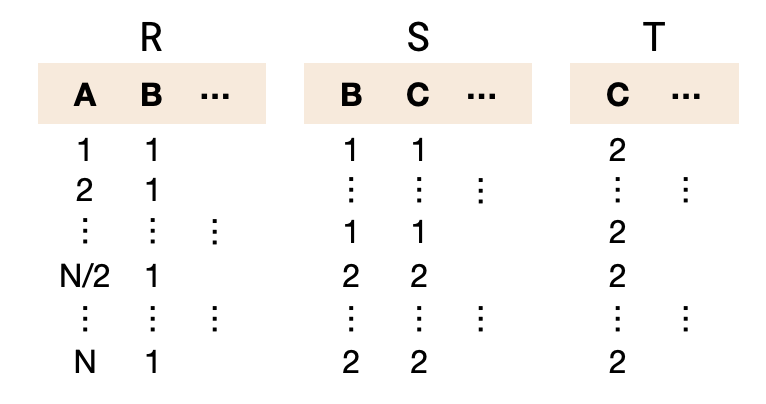

### 2.5.4 算法讨论

RPT通过结构化的谓词传播，先把输入压缩到更安全的状态，再执行后续 Join。LargestRoot 算法用于恢复无环查询上的完整传播路径，SafeSubjoin 算法用于限制 Join 阶段的中间结果规模，二者共同降低了查询性能对 Join Order 的依赖。

在 LargestRoot 算法中，RPT 启发式地将最大表放在根上可以减少在大表上构建和传播过滤器的成本，大表先接收来自其他表的 Bloom Filter 进行过滤，在自身数据缩小之后，再构造新的过滤器继续传播。

RPT 和 Yannak81 一样，其强鲁棒性保证主要建立在无环查询之上。对于有环查询，RPT 仍传播过滤信息，并且在很多情况下仍能带来收益，但不再保证中间结果不会膨胀，最坏计划与最好计划之间的差距也可能重新变大。对于这类场景，可考虑将 RPT 用在树状或近无环部分，而在环结构较强的部分结合 WCOJ（Worst-case optimal join算法） 或运行时反馈等机制。

RPT 对无环查询提供了鲁棒性保证，但存在过滤器冗余构建、过滤器过大的情况，后续的 **RPT+** 围绕这两点进行降本（👉 见 2.6 节）。

## 2.6 工程化落地实践——RPT+

> **核心点**：RPT+ 在保留 RPT 无环查询鲁棒性的基础上，进一步优化谓词传播的执行成本。RPT+通过非对称传播、级联过滤和动态动态流水线三个策略将过滤器传播建模为可优化的执行计划，降低 RPT 在部分查询上的性能回退。

RPT 的传播计划来自 LargestRoot算法：先在 Join 图上构造最大生成树，并以最大表为根；随后执行自底向上的前向过滤（forward pass）收集过滤信号，再执行自顶向下的后向过滤（backward pass）分发过滤信号。这个设计能实现类似 Yannakakis 的全约简效果，但也带来一个问题：同一棵树既承担"保证传播完整"的作用，又承担"决定过滤器构建和探测位置"的执行计划作用，当树形与实际等值类结构、数据分布或列存布局不匹配时，会产生额外开销，主要有两类：

**（1）冗余过滤器构建**：如果多个表的 Join Key 属于同一等值类，forward pass 逐步收敛交集是必要的，但 backward pass 再沿深树多次构建和传递相同交集，就可能重复做工。

**（2）过滤器过大**：如果某张表尚未被上游过滤，就先基于它构建 Bloom Filter，那么过滤器会包含大量后续会被淘汰的键值，导致探测更慢、缓存压力更大，甚至触发额外物化。

如图 2.25 所示，(b) 中，步骤 6 基于 movie_keyword 创建的 BF 是冗余的：步骤 4 与步骤 6 的表属于同一等价类（绿色），步骤 4 的过滤器可直接应用于 title。(c) 中，步骤 3 非最优：在 movie_keyword 被过滤前就为其构建 BF。更优方案是先将 title 的 BF（步骤 2 创建）应用于 movie_keyword，缩小 movie_keyword 规模后再构建更小的 BF。因此，图 2.25 中查询的理想传递计划应结合计划 1 的前向遍历与计划 2 的后向遍历。但 RPT 当前设计仅支持对称传递计划，前向与后向遍历遵循同一连接树。

 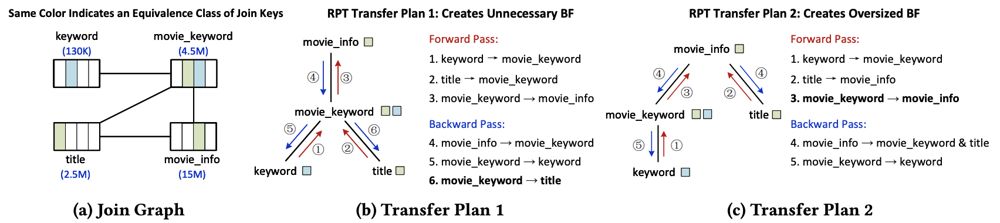

如图 2.26 所示，从开销剖面看，在部分 JOB 与 SQLStorm 查询中，RPT 的时间主要消耗在数据扫描和 Bloom Filter 构建上，甚至出现明显性能回退。这不是因为鲁棒性逻辑失效，而是因为鲁棒前缀过重，导致过滤收益不足以覆盖额外成本。

 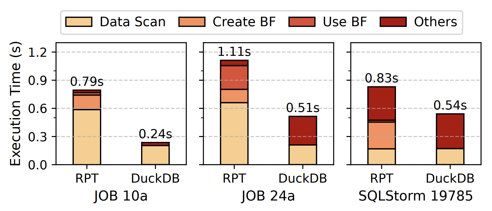

### 2.6.1 RPT+算法流程

**（1）非对称传播计划（Asymmetric Transfer Plan，ATP）**

在 RPT Transfer阶段修改连接树形态：

* 在forward pass中逐步收敛**等值类**的有效键值，用链式传播实现：先过滤一个表，再用过滤后的键值过滤下一个表，使后续 Bloom Filter 越来越小。
* 在backward pass中把已经收敛的键值集合分发给相关表，用广播实现：对同一等值类，理想情况是构建一次最终 Bloom Filter，然后让多个表各自探测一次。

如图 2.27 中展示了对称和非对称的传播计划。

 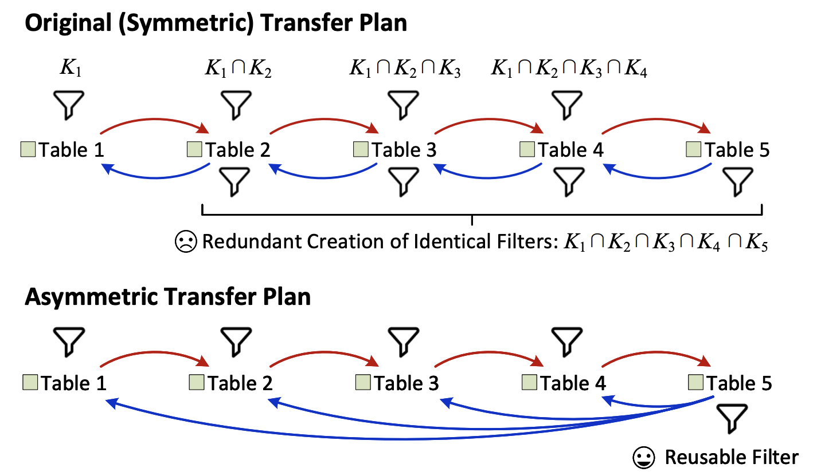

**（2）级联过滤（Cascade Filter）**

Min-max 索引可以在 row group 粒度上跳过整块数据，但过滤精度较粗；Bloom Filter 精度更高，但通常需要逐元组探测。Cascade Filter 将二者组合起来：先用 min-max 在 row group 粒度上做粗筛，尽量跳过无效数据块；再对剩余候选数据使用 Bloom Filter 做元组级过滤。

但如果 Bloom Filter 假阳性过高，许多本该被删除的键值会污染 min-max 的值域，导致 row group 跳读能力下降。

Cascade Filter的流程如图 2.28 所示。

 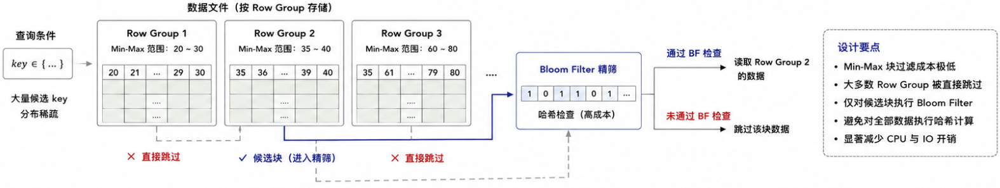

**（3）动态流水线（Dynamic Pipeline）**

RPT+ 在 RPT 的基础上引入更丰富的传播计划与级联过滤器，但过滤前缀并非总是"划算"：当谓词选择性弱、过滤粒度与列存 row group 跳读（min-max/zonemap）不匹配、或过滤器创建需要物化较大中间结果时，过滤的成本可能大于收益。

为了识别可有效过滤的表，RPT+把 forward transfer plan 限制在含谓词的表和用于键域转译的必要桥表。

但谓词也可能几乎不过滤，如99%的元组都通过。由于静态基数估计不可靠，RPT+引入动态流水线:

* 在过滤器创建的流水线里，运行时对"进入管线的元组数"和"到达物化点的元组数"计数；
* 由此得到实时的选择性估计，在扫描早期做出"继续/放弃"决策；
* 放弃时会合并被过滤器创建切开的两段 pipeline，同时消除对已放弃过滤器的下游探测。

放弃条件为两类：

* 选择性太高：过滤无效，元组保留率超过阈值；
* 物化过大：估计物化大小超过可用内存预算。

 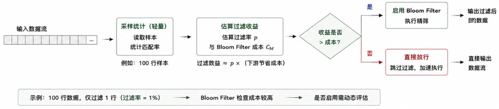

为了构建级联过滤器，系统需要在某个过滤器创建点 creator 物化一批通过上游过滤的 key，然后才能"做出过滤器"给下游用。这通常会引入一个流水线切分点。

以图 2.30 为例说明如何在流水线中动态决定是否构建级联过滤器。

如（a）所示，默认计划包含两条流水线：流水线1扫描基表，并应用一系列过滤器谓词、min-max过滤器与接收的级联过滤器；流水线2包含消费流水线1生成的中间表的算子。我们在级联过滤器创建器前插入一个选择性检查器，观测有多少元组通过所有上游过 滤器。执行过程中维护两个计数器：$N_{scan}（$扫描得到的元组数）与 $N_{recv}（$经过所有上游过滤器的元组数）。当$\gamma$ 个元组到达级联过滤器创建器时，估算总保留选择性为$\lambda = \frac{N_{recv}}{N_{scan}} $。该度量无需单独估计每个谓词，即可捕获所有上游谓词的组合过滤效果。

若出现下列情况则放弃创建过滤器并合并 pipeline，合并后的pipeline如（b）所示。

 $\lambda$ 高于阈值$( \lambda > \tau _ { s e l } )$，且扫描仍处于早期$( N _ { s c a n } / N _ { t o t a l } < \tau _ { p r o g } )$

表规模估计物化体积 $S$，且 $S > M_{avail}$

若未触发放弃条件，流水线 1 继续物化接收的元组并构建级联过滤器，流水线 2 则使用本地物化数据继续执行。

 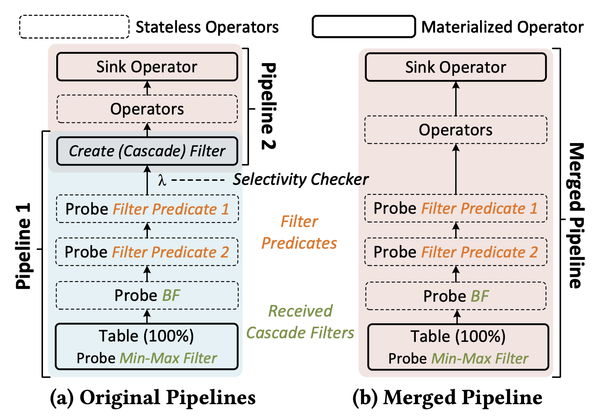

RPT+ 允许在运行时跳过剪枝收益低的"弱过滤"探测，在不影响正确性的前提下降低探测开销：

* 每个 BF probe 算子记录输入/输出计数，估计其通过率；
* 若通过率高于停止阈值，则禁用该过滤器的后续探测。

动态探测在有序列上可能存在偏差，因为聚集值会导致早期选择性样本不具代表性。级联过滤在 BF 探测前先应用min-max过滤器，可缓解上述问题。有序列生成紧凑的行组区域映射，min-max过滤器剪枝掉目标范围外的组，让 BF 仅在剩余组上执行判断，可以避免排序带来的偏斜。

包含两次 BF 探测的流水线示例如图 2.31 所示，先启用最值区间过滤器（min-max filter），仅当满足 $\lambda_i / \lambda_{i-1} < \tau_{\text{stop}}$ 时，才启用第 $i$ 个布隆过滤器（BF）。本例中启用了编号为 1 的布隆过滤器，跳过了编号为 2 的布隆过滤器。

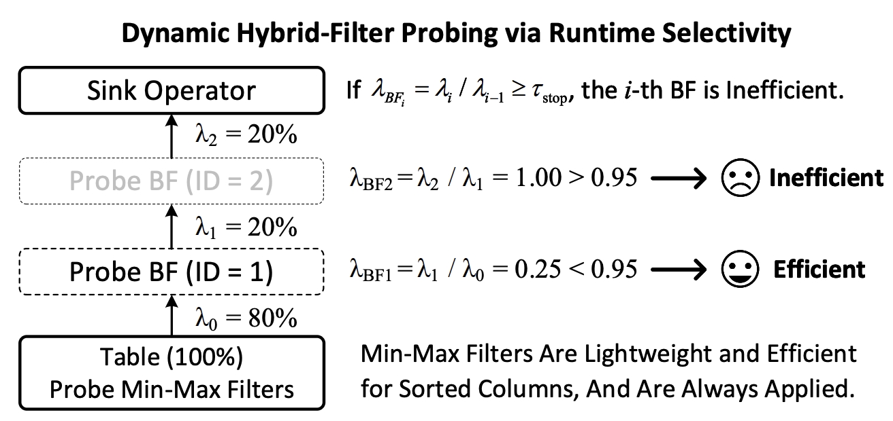

### 2.6.2 实验评估

评估使用四项基准：TPC-H（SF=100）、连接顺序基准测试（JOB）、Appian 基准测试与 SQLStorm 。

如图 2.32 所示，以 DuckDB 为基线，RPT 和 RPT+ 的分位数 speedup 曲线显示出明显差异：RPT 至少有 28% 的查询落入 $<0.9\times$ 的回退区间，而 RPT+ 将这一比例压低到 2.1%；同时，RPT+ 在右尾仍能保留较高加速，最高可达 $500\times$。

 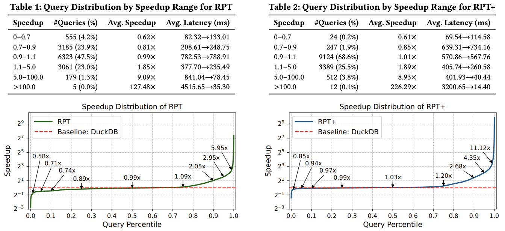

从平均性能看，RPT+ 在多个基准上保持正向收益：如图 2.33 所示*，*JOB 约 $1.47\times$，SQLStorm 约 $1.28\times$，TPC-H 约 $1.17\times$。在几乎没有明显剪枝空间的 Appian 上，RPT+ 也基本接近不变，约为 $1.01\times$，说明 Dynamic Pipeline 的放弃机制有效。

 

图 2.34 给出了ATP 与 LargestRoot 的对比：

（1）ATP 系列因更高效的传递计划优于LargestRoot 系列；

（2）Appian 基准几乎无选择性谓词，带动态流水线的ATP+ 与 LargestRoot+的效果较好；

（3）在 JOB 上，无级联过滤器的方案内存使用更高，这是由于min-max过滤器被打断，导致更多的冗余数据被加载到内存中。

 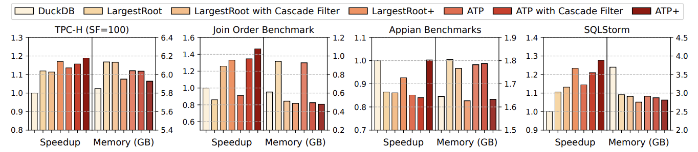

### 2.6.3 算法讨论

RPT+ 通过ATP、Cascade Filter和Dynamic Pipeline将 RPT 中"正确但可能偏重"的谓词传播，改造成了一个可优化、可组合、可取消的执行计划。其中，ATP 减少传播树上的冗余构建，Cascade Filter 将块级跳读和元组级过滤结合起来，Dynamic Pipeline 则避免在低收益场景中强行付出过滤成本。

从工程化的角度看，RPT+提了两个优化方向：

* Bloom Filter 探测路径优化。RPT+ 在 Cascade Bloom Filter 中使用向量化批处理和 SIMD，按 cache line 对齐，并使用 32-bit gather 指令降低访存成本。在参数设置上，每个 key 分配 20 bits，使用 7 个 hash functions，将假阳性率压到 $6.1\times 10^{-5}$，并将 probe 延迟控制在 2.48 cycles/tuple。
* 把"是否破坏 pipeline"纳入计划判断。某些查询中，过滤器本身可能是有效的，但插入过滤器创建点creator 后改变了原有流水线，若 probe 端提前扫描，错过 build 端生成的 min-max 信息，反而失去块级跳读的能力。RPT+ 的 Dynamic Pipeline 与 Cascade Filter 考虑是否执行过滤器创建：当过滤收益足够大时，接受 pipeline 分裂，并通过级联过滤尽量回收成本；当过滤收益不足时，直接放弃消过滤器构建，保留原有执行路径。

当学术界讨论如何将 Yannak81思想接入开源优化器时，部分商业数据库 SQL Svr 已经实现了类似的预过滤传播（👉 见 2.7 节）。

## 2.7 SQL Svr：Yannak81隐式用法

> **核心点**：SQL Svr 通过位图过滤器、基于拉取的执行机制以及 Cascades 优化器协同作用，隐式考量并频繁生成实例最优的执行计划。

学术界讨论 Yannak81 时，常强调现代数据库尚未完整采用这套理论算法。但论文研究团队发现Microsoft SQL Server 构建的位图预过滤基础设施，已然蕴含了Yannak81算法的核心思想。

### 2.7.1 SQL Srv 工程化设计

SQL Server 同时使用Bloom Filter和精确位向量过滤器，并将这两类过滤器统称为位图过滤器。

**（1）SQL Server 将位图过滤器巧妙融入基于拉取的执行机制中。**

SQL Srv提出批处理模式哈希连接（Batch Mode Hash Join，简称 HJ）是唯一能充分发挥 SQL Server 位图过滤器性能潜力的执行原语，其计划搜索空间包含了无环连接查询的所有Yannak81实例最优计划。在迭代器执行模型中，HJ.next ()实现了两个连续的步骤：

1）完整打开 build 侧，构建哈希表，优化器根据选择性等估计决定是否构建位图过滤器。位图过滤器的具体实现方式会延迟至运行时，根据在 build 阶段收集的统计信息自适应选择最优的位图配置，在位图过滤器的存储空间和误判率之间实现权衡：

* 允许假阳性，省空间的情况下，选用Bloom Filter；
* 不允许假阳性，key 值域紧凑的情况下，选用精确位向量过滤器；

2）打开 probe 侧，通过启发式策略把位图过滤器尽可能下推至 probe 子树的底层，拉取 batch 做探测并输出，可结合 row group 自带的 min/max 统计进行"整块跳过"。

多个 Hash Join 串联时，位图会随着基于拉取的执行自然形成级联传播，隐式实现Yannak81算法的自底向上遍历过程，无需额外的执行逻辑即可实现实例最优性。

如图 2.35 、图 2.36 和图 2.37 所示， 以 TPC-H Q3 为例，根节点 Hash Join 先在 customer 上构建哈希表，并生成 customer key 的位图，下推到 orders；orders 经过该位图过滤后，再作为下一层 Hash Join 的 build side，生成 orders key 的位图，继续下推到 lineitem。在真正进行高成本 Join 探测之前，大量不可能匹配的行已经在扫描侧被提前过滤。这对应了 Yannakakis 中自底向上的半连接预处理思想。

 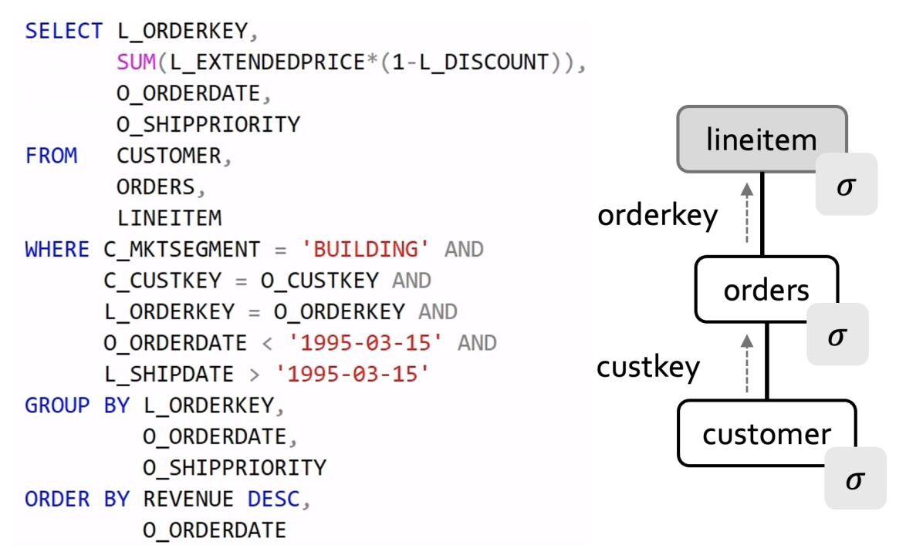

 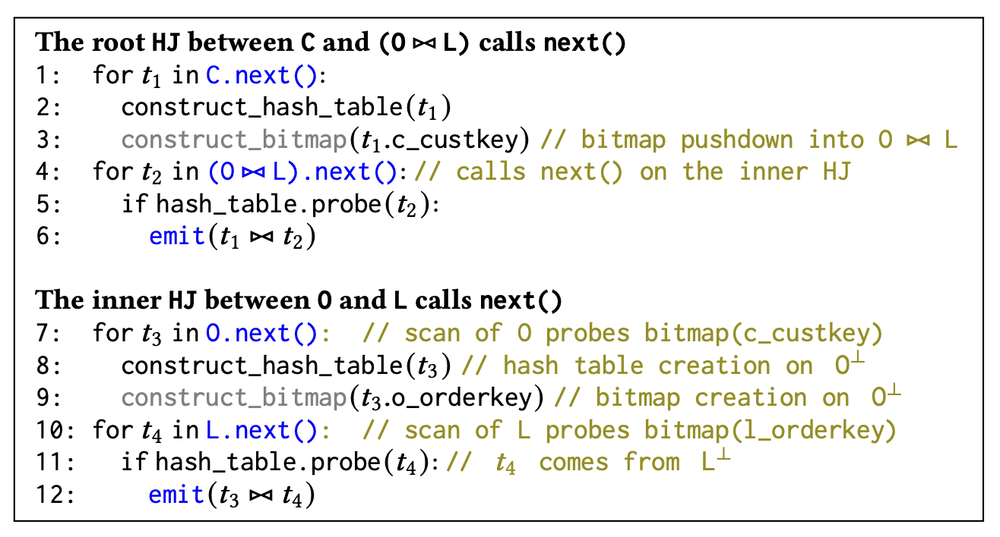

 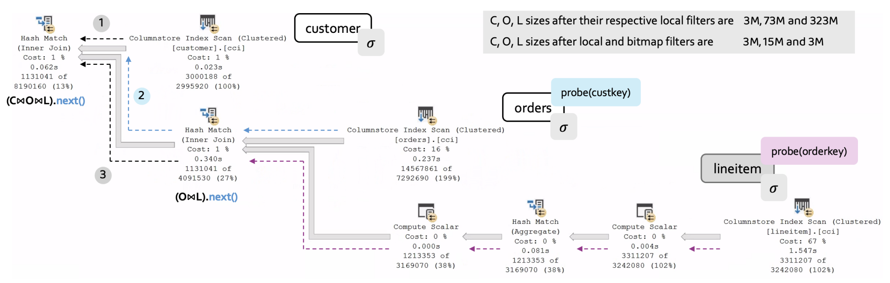

随后SQL Server移除了Yannak81算法中的自顶向下半连接过程，直接沿连接树从根向叶探测哈希表并输出，即backward probing，能保证中间结果不超过 $O(OUT)$ 级别：如果父表在自底向上阶段已经被子表做过半连接，那么在Join阶段用父表去 probe 子表的哈希表时，每次哈希表查找都至少能找到一个匹配，backward probing 的总工作量可被输出规模 $OUT$ 绑定，得到 $O(OUT)$。

当 join 图有环、或含嵌套子查询等更一般结构时，实例最优通常不可达。SQL Server 的工程策略是：一般查询计划的代价容易依赖多个中间结果 $OUT_1, OUT_2, \dots$，通过"把复杂 join 拆成若干局部（常是无环的）组件 + 在组件内用位图实现接近实例最优的执行"，使运行时只依赖少数关键 stitching 边界的中间结果，从而对基数误估更不敏感。

完整的流程如图 2.38 所示。

 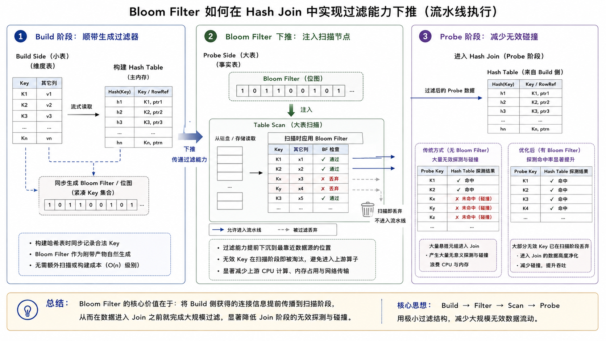

**（2）将位图过滤器直接纳入 Cascades 优化器的代价计算框架中。**

仅靠执行器层面的启发式很难稳定地决定"在哪些 join 上建位图过滤器、下推到哪里、是否级联"。

在查询规划阶段，位图过滤器是优化器中一个原生的代价维度。当逻辑 join 通过实现规则转换为 hash join 时，优化器引入并传播一个上下文（context，ctx），包含来自祖先计划片段的位图过滤器统计，例如估计的选择性、大小等。优化器在估算 build 侧的选择性后，将位图过滤器的选择性信息写入ctx，传播至probe侧子树， probe 子树的代价与基数估计会按"已被上游位图过滤器缩小"来计算。

同一段 probe 子树，在"没有位图过滤"和"进入前已经被位图过滤掉 80% 行"这两种前提下，最优物理计划可能不同。优化器需要将位图选择性作为一种ctx传递给 probe 子树，让子树在新的基数假设下重新优化，但这扩大了优化器的搜索空间，优化阶段可能变慢，SQL Server 用三类启发式方法降低爆炸：

* 通过搜索深度、代价上界和候选数量 cap 限制枚举规模，提前停止明显无收益的搜索分支。这样可以避免位图上下文、级联传播和 Join Order 枚举之间形成组合爆炸。
* 将相近地选择性分桶：把选择性估计截断到少数阈值档位（例如 75%、10%、1%、0.1% 等），减少 ctx 的种类，从而提升缓存复用并限制搜索分支数。例如 37.2% 与 37.4% 可以归入同一档，避免生成大量几乎等价的上下文。
* Early Stopping（早停）：优先探索支持位图的哈希连接实现方式，一旦找到一个很好的候选，就立刻收紧 cap，用更激进的剪枝淘汰后续不太可能更优的候选。

对于有环 Join 图，SQL Server 不再能获得无环查询上的实例最优性质，但仍可以通过中间结果上的位图构建增强预过滤能力。如图 2.39所示，以 TPC-H Q5 为例，优化器可以选择 bushy 计划，将复杂 Join 图拆成若干局部子计划。在某些阶段，系统先完成一个中间连接，例如 $(C \bowtie O)$，再基于该中间结果构建位图，用于过滤另一侧的 lineitem。相比只从基表构建位图，这种做法能利用已经被过滤过的中间结果生成更强的过滤器。

这种"基于中间结果构建位图"的能力，使位图前置过滤不再局限于基表之间，而可以跨子计划边界继续传播。它不能保证所有中间结果都不膨胀，但可以让执行代价更多依赖少数关键中间体的规模，而不是完全暴露在每一步局部 Join 的波动中。

 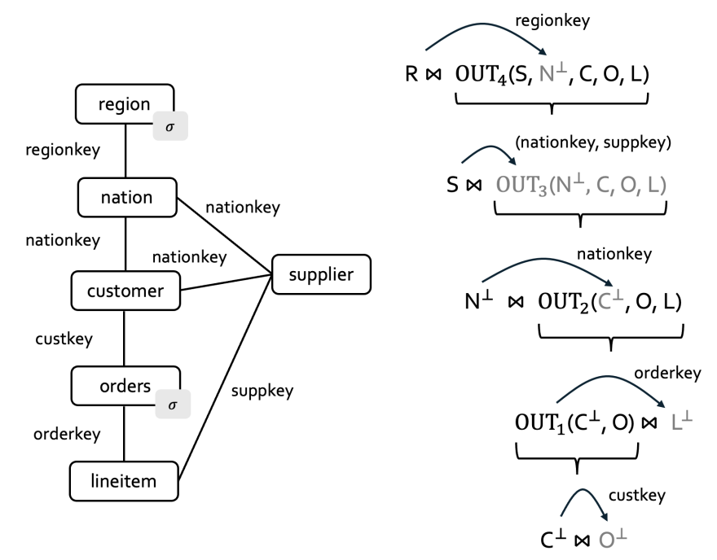

### 2.7.2 实验评估

实验基于SQL Server 2025，采用TPC-H SF100基准。

与禁用位图过滤器相比，启用位图过滤器整体带来稳定加速。如表 2.6 所示，在 22 条查询中，有 7 条查询加速超过 $2\times$，最高达到 $3.47\times$。计划分析显示，在 12 条无环查询上，优化器选择了接近实例最优的计划；而在 Q5 这类有环查询和 Q17 这类带嵌套子查询的场景中，bushy 计划与中间结果位图构建也能带来明显收益，例如 Q5 达到 $2.33\times$，Q17 达到 $2.55\times$。

表 2.6 中的▲符号表明，位图过滤器的代价计算会导致部分查询的规划阶段出现性能下降。仅有 5 个查询表现出可感知的优化器开销增加，其余查询的计划探索耗时基本相当，甚至有所缩短（所有波动均在 ±5% 范围内）。

表 2.6 的最后三列展示了 SQL Srv 与Yannak81 执行预过滤后保留的行占比。SQL Srv 位图过滤器的实现了数据量的大幅缩减，部分查询（Q2、Q19、Q20）过滤掉了 99% 以上的非连接行，多个查询（如 Q9、Q11、Q17）实现了接近最优的预过滤效果。两者间超过 1% 的差距（红色标注）源于两方面原因：

（1）SQL Server 最多仅执行一轮位图预过滤，无法像Yannak81的多轮半连接那样，在整个Join 图中高效传播位图；

（2）Bloom Filter的误判率带来的累积影响，加之部分低效果的预过滤被跳过，进一步扩大了这一差距。

表 2.6 TPC-H(SF=100) 结果 ✓（×）表示是否选择了实例最优执行计划；— 代表不适用场景（如循环连接、相关子查询连接）；▲ 表示优化器性能下降 / 耗时增加。最后三列依次为：所有输入表经本地过滤器过滤后的总行数（百万行）、SQL Server 预过滤后数据占比、Yannakakis / PT 算法过滤后数据占比。

 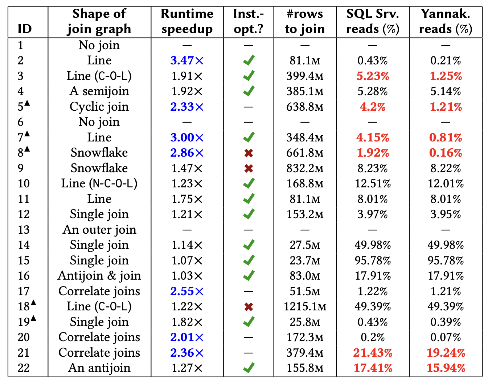

生产负载进一步说明了这一机制的边界。在遥测数据中，约 $7\%$ 的连接查询超过 8 张表，极端情况下甚至达到千表级；约 $15\%$ 的查询包含 outer、range、anti 等混合连接类型。对于这类高维、异构、估计误差累积明显的查询，位图放置会更加困难，如*图2-7-5*所示，在过滤约简效果上，SQL Srv和Yannak81还存在差距。说明SQL Srv缺乏与Yannak算法具备同等理论基础的预过滤方案。

 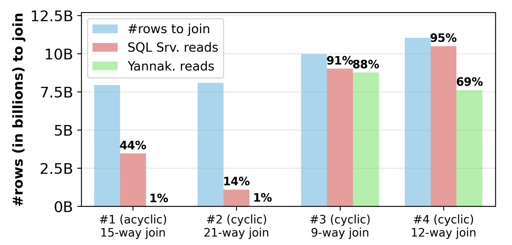

# 三、Yannakakis 关键技术

> 本章对比 Yannak81、Yannak+、PT、RPT、RPT+、SQL Srv 的算法思路和工程优化。首先通过多维度的对比表，横向剖析各算法在传播结构、执行阶段与约简程度上的差异；随后，探讨工程实践中压低常数开销的关键技术。

## 3.1 算法对比

表 3.1 给出了 Yannak81、Yannak+、PT、RPT、RPT+、SQL Srv 在传播结构、执行阶段和约简程度上的总结。

表 3.1 算法传播结构与执行阶段一览表

| 算法 | 传播结构 | 执行阶段 | 约简程度 |
|---|---|---|---|
| Yannak81 | GYO算法构造的连接树 | 1. 两遍精确半连接；<br>2. Join阶段：按树拓扑执行正式连接。 | 无环查询：完全约简，Free-connex CQs 满足 $O(N + OUT)$，非 Free-connex CQs 满足 $O(\min(N \cdot OUT, F))$；<br>有环查询：不存在对所有实例通用的完全半连接规约序列，无法达到完全约简。 |
| Yannak+ | GYO算法构造的连接树或 GHD + Bag 构造的无环广义连接树 | 1. 一轮自底向上半连接；<br>2. 一轮自顶向下连接。 | 无环查询：完全约简，Free-connex CQs 满足 $O(N + OUT)$，Relation-dominated CQs 满足 $O(N)$，其余无环查询满足 $O(\min(N \cdot OUT, F))$。 |
| PT | “小表优先”的启发式规则生成的谓词传播有向无环图 | 1. 对称的两遍 Bloom Filter 半连接；<br>2. Join阶段：按树拓扑执行正式连接。 | 不保证任意实例上的满足 $O(N + OUT)$ 的完全约简，约简强度取决于 Bloom Filter 假阳性和谓词传播有向无环图的定向与遍历顺序。 |
| RPT | LargestRoot 算法构造的连接树 | 1. Transfer阶段：计算对称的两遍 Bloom Filter 半连接的逻辑顺序并插入 LogicalCreateBF 和 LogicalProbeBF 算子；<br>2. Join阶段：将逻辑算子替换为 CreateBF 和 ProbeBF 物理算子，按树拓扑执行正式连接。 | 无环查询：可在 $O(N + OUT)$ 逼近完全约简，保证一个无环查询的运行时代价与最优代价的比值不超过一个常数因子。 |
| RPT+ | LargestRoot 算法构造的连接树 | 1. Transfer阶段：计算不对称的两遍 Bloom Filter 半连接的逻辑顺序，将 Bloom Filter 作为算子插入执行计划中；<br>2. Join阶段：按树拓扑执行正式连接。 | 无环查询：可在 $O(N + OUT)$ 逼近完全约简，保证一个无环查询的运行时代价与最优代价的比值不超过一个常数因子。Dynamic Pipeline 可在运行时弱化或跳过部分过滤步骤，约简程度随阈值与预算浮动。 |
| SQL Srv | 优化器给出的执行计划 | Join阶段：包含至多一轮位图预过滤，和正式连接。 | 无环查询：接近实例最优预过滤；<br>有环与一般查询：依赖 bushy 与中间结果位图，约简程度受计划形态与上下文搜索边界约束。 |

这六篇文章演进的路线可分为两条：

* Yannak81 奠定完全约简理论 $\rightarrow$ Yannak+ 降低原始算法开销并适配现代架构
* Yannak81 奠定完全约简理论 $\rightarrow$ PT 论证了低成本 Bloom Filter 传播的威力但缺失结构兜底 $\rightarrow$ RPT 吸收 PT 的轻量化载体并找回 Yannak81 的结构化鲁棒保证 $\rightarrow$ RPT+ 进一步修复 RPT 的冗余开销缺陷 $\rightarrow$ SQL Srv 展现了Yannak81思想在商用架构中的隐式存在形态。

Yannak81 与 Yannak+ 追求逻辑上的绝对正确与无环上的完全约简，代价是精确半连接高昂的常数开销和物化成本。PT、RPT 及其变体退而求其次，使用 Bloom Filter 允许一定的假阳性，用"近似过滤"换取了极大的计算与访存性能提升。

RPT 用全约简结构保证了最差情况的下限（Robustness），但可能引入一些无意义的 Bloom Filter 构建拖慢整体速度。RPT+ 则权衡了静态的结构连贯性，引入动态选择性监控，在"保证最差"和"避免回退"之间取得了平衡。

除Yannak81外，后续工程落地Yannak+、PT、RPT、RPT+、SQL Srv均达成了以下技术共识：

* 采用近似概率数据结构（如 Bloom Filter 或位图过滤器）替代高昂的精确半连接来执行预过滤。
* 将过滤操作尽可能前置并廉价化。让大量悬挂元组进入核心代价极高的 Join 探测阶段是不合理的，通过结构化（图或树）的传播路径收集并分发约束信号，从而在底层扫描（Scan）阶段就缩减参与运算的数据量，可有效突破多表连接性能瓶颈。

Yannak+ 构建了一个外置的中间件系统（Quorion），可将 IRs 转换为方言下推至多种开源与商业引擎（DuckDB, PostgreSQL等）；PT、RPT、RPT+ 选择侵入式修改特定开源列存引擎的底层流水线（FlexPushdownDB、DuckDB）；SQL Srv 则是完全闭源重度集成于商用级数据库内核的优化器与执行器中。

在进行基准测试时，除绝大多数研究都共同选择了经典的学术界与产业界标准基准，如 TPC-H 和 JOB，来验证算法在复杂业务场景下的表现。

* **Yannak+** 在 TPC-H 和 JOB 上均获得平均加速，特别是在处理含有复杂聚合和大量悬挂元组的情况下优势明显。
* **PT** 在 TPC-H Q5 这种包含长链路维度表的场景下表现抢眼（较 Bloom Join 平均加速 3.3x），但在 JOB 这类包含密集 Join 和弱选择性谓词的基准中容易遭遇假阳性累积导致的收益收窄。
* **RPT vs PT**：RPT 解决了 PT 对 Join 顺序敏感的问题，将 TPC-H 等负载的鲁棒性因子（最慢/最快时间比）从 DuckDB 原生的百倍级（如 TPC-DS 为 224）压缩到平均 1.5 倍左右，确保最坏计划接近最优。
* **RPT+ vs RPT**：RPT+ 成功压低了 RPT 性能回退的比例（从 28% 降至 2.1%），在 JOB 的几何平均加速比提升至 1.47x，证明其动态跳过弱过滤的有效性。
* **优劣势场景**：
* **Yannak系/RPT系**：极度擅长雪花型/星型及链式无环分析查询；不擅长结构极其复杂且含多处强环的查询（虽有 GHD 等降维手段，但退化明显）。
* **SQL Srv**：擅长利用中间结果和 bushy 计划灵活处理有环与一般结构；但在超过8张表的高维、异构生产级 SQL 面前，其预过滤效果仍明显逊色于严格的 Yannakakis 算法排布。

除 TPC-H 和 JOB 外，仅 Yannak+ 覆盖了图数据（SGPB）和社交网络（LSQB）；RPT+ 额外测试了 Appian 以验证动态取消机制；SQL Srv 引入了高维异构的生产线遥测数据来探测算法的物理边界。

## 3.2 工程优化

在Yannak81中，精确半连接视为用对端键集过滤本端的强过滤器。除 Yannak81 外，过滤器主要指运行期可构建、下推、复用的 Bloom Filter、位图过滤器（Batch Mode Hash Join 语境下将Bloom Filter与精确位向量过滤器统称为位图过滤器）以及级联过滤器（Cascade Filter）。

**（1）减少半连接次数**

**Yannak+** 通过算子重排，把 Yannak81 的「两遍半连接与一轮连接」改进为「一轮自底向上的半连接和一轮自顶向下的连接」：第二轮不再承担与 Yannak81 对称的「全树半连接」职责，从而在调度上消去一整轮全树半连接；在自底向上的半连接中，叶节点就地消元与移除、聚合下推，使部分子树不再参与后续半连接。Relation-dominated 时第一轮即可早停，后续半连接与连接整体不发生。

**SQL Srv** 相对 Yannak81 不再显式执行第二轮自顶向下半连接，至多执行一轮位图预过滤，由自底向上的 probing 与位图过滤器沿 probe 子树的级联传播实现对元组的约简。

**（2） 减少过滤器构建次数与成本**

**Yannak+** 走「少做无效半连接就少做无效构建」路线：聚合下推、投影剔除冗余列、半连接消除、维度表融合缩小参与半连接与连接的行与列；CBO 选好连接树则减少冗余传播路径上的重复工作——过滤器若与半连接同构出现，其构建次数自然随无效半连接的消失而下降。CBO 在 GYO/GHD 枚举上裁剪（输出属性结点尽量靠根、较大事实表置于较高位置、倾向丛生树等）；RBO 含主键约束去环、冗余聚合消除、半连接消除、标注列裁剪、维度表融合等。

**PT** 用启发式的谓词传递把远端选择性提前到大表 join key，减少进入后续阶段的事实表行数；在同一次扫描内完成多路入站 Bloom Filter探测与出站 Bloom Filter 构建，在 I/O 与列存扫描路径上实现算子融合，多条入边过滤器在同一读趟被消费；键域转译把上一跳存活键映射为下一跳 join key，使过滤语义在多跳上链式复用，而不必为每一跳从基表重建完整键域。

**RPT** 强调 LargestRoot（最大表为根）：大表先经上游 Bloom Filter 收缩再参与下游 Bloom Filter的构建，直接控制 Bloom Filter体积；向量化路径上从位向量映射到 Selection Vector 降低探测侧常数；在计划中先插入逻辑算子 LogicalCreateBF / LogicalProbeBF ，避免在「尚未收缩的大表」上率先构建巨型过滤器。

**RPT+** 在 RPT 之上叠加 ATP，在forward pass 阶段链式执行使表依次被过滤，后续 Bloom Filter 探测落在更窄的候选元组集上；Cascade Filter 的 min-max 在 row group 粒度跳过整块，Bloom Filter的元组级探测只落在剩余候选块；Dynamic Pipeline 在过滤无效时阻断大批元组进入 creator 物化路径；弱过滤探测禁用避免在高通过率的数据上为每个元组支付 Bloom Filter 探测开销。

**SQL Srv** 在 build 侧完成之后再决定是否以及如何构建位图过滤器，运行时按空间与误判率权衡考虑Bloom Filter 与精确位向量过滤器；将位图过滤器下推至 probe 子树最底层的扫描，减少了进入 HJ 探测的元组；级联位图过滤器使下层 build 建立在已缩小的输入上，逐层收窄后续探测空间；Cascades 侧以 ctx 分桶、cap、Early Stopping（早停） 控制「为位图过滤器重搜子计划」的组合爆炸，减少执行性价比低的位图方案；有环时采用 bushy 计划，并允许在中间结果这种已收缩的输入上建位图过滤器。

**（3）增强过滤器「复用」**

同一过滤信息或同一物理过滤器被多消费者、多跳、多算子共享。

**RPT** 令 Bloom Filter经共享内存传递，多个 ProbeBF 只是 同一块 Bloom Filter 的多个读端；实现了高效的位向量到 Selection Vector 的映射，将位向量转成 Selection Vector 后可在多块数据上重复应用同一过滤信息。

**RPT+** 的 ATP 在 backward pass 上对同一等值类落实 「建一次 Bloom Filter、多表各探一次」。

**（4）流水线与阶段屏障**

**Yannak81** 要求在两遍精确半连接阶段，需要完成完全规约，再开始执行连接，与Join阶段之间形成阶段屏障，与要求「长流水、少物化」的主路径存在冲突。

**Yannak+** 将计划族写成标准 DAG 算子（选择、投影、半连接、连接等），能自然享受宿主引擎的向量化 / 批式流水；相对「两遍半连接 + 连接」的经典编排，算子重排有利于减少「为完备性而停顿」的次数。

**RPT** 将 Bloom Filter 实现为算子，在流水线中执行Bloom Filter的创建和探测。但由于创建Bloom Filter会中断pipeline，流水线被划分为多段。

**RPT+** 用 Dynamic Pipeline 策略在Bloom Filter收益不足时放弃构建过滤器，合并两段流水线。

**SQL Server** 的 Batch Mode Hash Join（HJ） 在 pull `next()` / `HJ.next()` 下先完成 build 侧（可选构建位图过滤器）再拉取数据进行探测；位图过滤器下推到 probe 子树底层扫描，与 HJ 同节拍。相对 Yannak81「整轮规约 与 Join 之间」的阶段屏障，这里的屏障粒度落在每层 HJ 的 build↔probe 上。

# 四、实验复现

> **导语**
>
> 前文梳理了对 Yannak 81 工程化实现的两条路线，包括：1）基于过滤器流水线（RPT、RPT+、SQL Svr）；2）基于 SQL 重写（Yannak+、Quorion）。
>
> 本章从两条路线**各选择一项代表性工作**——RPT 与Quorion——进行端到端复现与验证，以考察其在不同数据集、连接顺序与并行度下的实际表现是否与原论文结论一致。
>
> 前两节按"实验环境—测试流程—复现结果—问题记录"的顺序组织。
>
> * 4.1 节围绕 RPT 展开：以集成 RPT 的 DuckDB 为对象，分别在随机左深与随机丛状连接计划下度量端到端鲁棒性与多线程鲁棒性，并将 RPT 与原生 DuckDB、布隆连接（Bloom Filter Join）以及原始谓词传递（PT）在加速比上进行横向对比。
> * 4.2 节围绕 Quorion（Yannak+）展开：在 DuckDB 上测量重写后查询在 SGPB、LSQB、TPC-H 与 JOB 等基准测试集上的运行耗时与加速比，并补充不同选择度与并行度下的扩展性观测。
> * 4.3 节与4.4 节介绍RPT与Quorion的源码实现。

## 4.1 RPT 复现记录

**gitlab链接**：[http://tprd-gitlab.dameng.com/zxw/robust-predicate-transfer](http://tprd-gitlab.dameng.com/zxw/robust-predicate-transfer)

### 4.1.1 实验环境

* X86_64系统架构
* apache arrow 16.0.0

实验使用的硬件与系统环境如表 4.1 所示。

表 4.1 硬件配置与系统环境

| 实验环境 | 论文使用                              | 复现使用                                          |
| -------- | ------------------------------------- | ------------------------------------------------- |
| CPU      | Intel®Xeon® Platinum 8474C @ 2.1GHz | Intel® Core™ i9 processor 14900K @ 3.2GHz       |
| 内存     | 512GB DDR5 RAM                        | 128GB DDR5 RAM                                    |
| 磁盘     | 8TB Samsung 870 QVO SATA III 2.5" SSD | 2TB aigo P7000Y NVMe PCIe3.0 M.2 SSD(约800GB可用) |
| 系统     | Debian 12.5                           | ubuntu 22.04                                      |
| 集成系统 | DuckDB 0.9.2                          | DuckDB 0.9.2                                      |

#### (1) 安装依赖项

```bash
# 下载源码
wget https://archive.apache.org/dist/arrow/arrow-16.0.0/apache-arrow-16.0.0.tar.gz
# 解压
tar -zxvf apache-arrow-16.0.0.tar.gz
cd apache-arrow-16.0.0/cpp
# 新建编译目录
mkdir build && cd build
# 编译配置
cmake .. -DCMAKE_INSTALL_PREFIX=/usr/local
# 编译
make -j$(nproc)
# 安装到系统
sudo make install
# 检查是否安装成功(安装成功会返回版本号)
pkg-config --modversion arrow
```

注：从源码编译安装apache arrow 16.0.0时需要用到一些依赖，如 `xsimd-9.0.1.tar.gz`、`jemalloc-5.3.0.tar.bz2`，一般情况下在编译安装arrow过程中系统会自动下载，如因网络问题无法下载，可在网络良好的环境下下载并移动到 `RPT/apache-arrow-16.0.0/cpp/build/src/`路径下。

#### (2) 准备数据集

本实验用到四类基准测试集：

* [join order benchmark(JOB)](https://github.com/danolivo/jo-bench)
* [TPC-H](https://www.tpc.org/TPC_Documents_Current_Versions/download_programs/tools-download-request5.asp?bm_type=TPC-H&bm_vers=3.0.1&mode=CURRENT-ONLY)
* [TPC-DS](https://www.tpc.org/TPC_Documents_Current_Versions/download_programs/tools-download-request5.asp?bm_type=TPC-DS&bm_vers=4.0.0&mode=CURRENT-ONLY)
* [Decision Support Benchmark(DSB)](https://github.com/microsoft/dsb)

其中JOB直接可用，TPC-H、TPC-DS、DSB需要自行生成数据。

论文测试使用sf=100的规模因子来生成TPC-H、TPC-DS、DSB基准测试集；本次复现由于硬件限制，使用sf=1的规模因子生成TPC-H、TPC-DS、DSB基准测试集。

#### (3) 数据导入

本刊提供将TPC-H、TPC-DS、DSB导入DuckDB数据库文件的sql脚本，实际使用需修改基准测试集数据文件路径。

* **import_dsb.sql**

```sql
-- ==========================================
-- 1. 管理表与维度表 (Dimension Tables)
-- ==========================================
COPY dbgen_version          FROM '/home/dmpr/RPT/datasets/dsb-main/data/dat_sf_10/dbgen_version.dat'          (DELIMITER '|');
COPY call_center            FROM '/home/dmpr/RPT/datasets/dsb-main/data/dat_sf_10/call_center.dat'            (DELIMITER '|');
COPY catalog_page           FROM '/home/dmpr/RPT/datasets/dsb-main/data/dat_sf_10/catalog_page.dat'           (DELIMITER '|');
COPY customer               FROM '/home/dmpr/RPT/datasets/dsb-main/data/dat_sf_10/customer.dat'               (DELIMITER '|');
COPY customer_address       FROM '/home/dmpr/RPT/datasets/dsb-main/data/dat_sf_10/customer_address.dat'       (DELIMITER '|');
COPY customer_demographics  FROM '/home/dmpr/RPT/datasets/dsb-main/data/dat_sf_10/customer_demographics.dat'  (DELIMITER '|');
COPY date_dim               FROM '/home/dmpr/RPT/datasets/dsb-main/data/dat_sf_10/date_dim.dat'               (DELIMITER '|');
COPY household_demographics FROM '/home/dmpr/RPT/datasets/dsb-main/data/dat_sf_10/household_demographics.dat' (DELIMITER '|');
COPY income_band            FROM '/home/dmpr/RPT/datasets/dsb-main/data/dat_sf_10/income_band.dat'            (DELIMITER '|');
COPY item                   FROM '/home/dmpr/RPT/datasets/dsb-main/data/dat_sf_10/item.dat'                   (DELIMITER '|');
COPY promotion              FROM '/home/dmpr/RPT/datasets/dsb-main/data/dat_sf_10/promotion.dat'              (DELIMITER '|');
COPY reason                 FROM '/home/dmpr/RPT/datasets/dsb-main/data/dat_sf_10/reason.dat'                 (DELIMITER '|');
COPY ship_mode              FROM '/home/dmpr/RPT/datasets/dsb-main/data/dat_sf_10/ship_mode.dat'              (DELIMITER '|');
COPY store                  FROM '/home/dmpr/RPT/datasets/dsb-main/data/dat_sf_10/store.dat'                  (DELIMITER '|');
COPY time_dim               FROM '/home/dmpr/RPT/datasets/dsb-main/data/dat_sf_10/time_dim.dat'               (DELIMITER '|');
COPY warehouse              FROM '/home/dmpr/RPT/datasets/dsb-main/data/dat_sf_10/warehouse.dat'              (DELIMITER '|');
COPY web_page               FROM '/home/dmpr/RPT/datasets/dsb-main/data/dat_sf_10/web_page.dat'               (DELIMITER '|');
COPY web_site               FROM '/home/dmpr/RPT/datasets/dsb-main/data/dat_sf_10/web_site.dat'               (DELIMITER '|');

-- ==========================================
-- 2. 事实表 (Fact Tables)
-- ==========================================
COPY inventory              FROM '/home/dmpr/RPT/datasets/dsb-main/data/dat_sf_10/inventory.dat'              (DELIMITER '|');
COPY catalog_returns        FROM '/home/dmpr/RPT/datasets/dsb-main/data/dat_sf_10/catalog_returns.dat'        (DELIMITER '|');
COPY catalog_sales          FROM '/home/dmpr/RPT/datasets/dsb-main/data/dat_sf_10/catalog_sales.dat'          (DELIMITER '|');
COPY store_returns          FROM '/home/dmpr/RPT/datasets/dsb-main/data/dat_sf_10/store_returns.dat'          (DELIMITER '|');
COPY store_sales            FROM '/home/dmpr/RPT/datasets/dsb-main/data/dat_sf_10/store_sales.dat'            (DELIMITER '|');
COPY web_returns            FROM '/home/dmpr/RPT/datasets/dsb-main/data/dat_sf_10/web_returns.dat'            (DELIMITER '|');
COPY web_sales              FROM '/home/dmpr/RPT/datasets/dsb-main/data/dat_sf_10/web_sales.dat'              (DELIMITER '|');
```

* **import_tpch.sql**

```sql
COPY region    FROM '/home/dmpr/RPT/datasets/TPC-H V3.0.1/data_sf_10/region.tbl'   (DELIMITER '|');
COPY nation    FROM '/home/dmpr/RPT/datasets/TPC-H V3.0.1/data_sf_10/nation.tbl'   (DELIMITER '|');
COPY part      FROM '/home/dmpr/RPT/datasets/TPC-H V3.0.1/data_sf_10/part.tbl'     (DELIMITER '|');
COPY supplier  FROM '/home/dmpr/RPT/datasets/TPC-H V3.0.1/data_sf_10/supplier.tbl' (DELIMITER '|');
COPY customer  FROM '/home/dmpr/RPT/datasets/TPC-H V3.0.1/data_sf_10/customer.tbl' (DELIMITER '|');
COPY partsupp  FROM '/home/dmpr/RPT/datasets/TPC-H V3.0.1/data_sf_10/partsupp.tbl' (DELIMITER '|');
COPY orders    FROM '/home/dmpr/RPT/datasets/TPC-H V3.0.1/data_sf_10/orders.tbl'   (DELIMITER '|');
COPY lineitem  FROM '/home/dmpr/RPT/datasets/TPC-H V3.0.1/data_sf_10/lineitem.tbl' (DELIMITER '|');
```

* **import_tpcds.sql**

```sql
-- 开始导入维度表 (Dimension Tables)
COPY dbgen_version           FROM '/home/dmpr/RPT/datasets/DSGen-software-code-4.0.0/data_sf_10/dbgen_version.dat'           (DELIMITER '|');
COPY customer_address        FROM '/home/dmpr/RPT/datasets/DSGen-software-code-4.0.0/data_sf_10/customer_address.dat'        (DELIMITER '|');
COPY customer_demographics   FROM '/home/dmpr/RPT/datasets/DSGen-software-code-4.0.0/data_sf_10/customer_demographics.dat'   (DELIMITER '|');
COPY date_dim                FROM '/home/dmpr/RPT/datasets/DSGen-software-code-4.0.0/data_sf_10/date_dim.dat'                (DELIMITER '|');
COPY warehouse               FROM '/home/dmpr/RPT/datasets/DSGen-software-code-4.0.0/data_sf_10/warehouse.dat'               (DELIMITER '|');
COPY ship_mode               FROM '/home/dmpr/RPT/datasets/DSGen-software-code-4.0.0/data_sf_10/ship_mode.dat'               (DELIMITER '|');
COPY time_dim                FROM '/home/dmpr/RPT/datasets/DSGen-software-code-4.0.0/data_sf_10/time_dim.dat'                (DELIMITER '|');
COPY reason                  FROM '/home/dmpr/RPT/datasets/DSGen-software-code-4.0.0/data_sf_10/reason.dat'                  (DELIMITER '|');
COPY income_band             FROM '/home/dmpr/RPT/datasets/DSGen-software-code-4.0.0/data_sf_10/income_band.dat'             (DELIMITER '|');
COPY item                    FROM '/home/dmpr/RPT/datasets/DSGen-software-code-4.0.0/data_sf_10/item.dat'                    (DELIMITER '|');
COPY store                   FROM '/home/dmpr/RPT/datasets/DSGen-software-code-4.0.0/data_sf_10/store.dat'                   (DELIMITER '|');
COPY call_center             FROM '/home/dmpr/RPT/datasets/DSGen-software-code-4.0.0/data_sf_10/call_center.dat'             (DELIMITER '|');
COPY customer                FROM '/home/dmpr/RPT/datasets/DSGen-software-code-4.0.0/data_sf_10/customer.dat'                (DELIMITER '|');
COPY web_site                FROM '/home/dmpr/RPT/datasets/DSGen-software-code-4.0.0/data_sf_10/web_site.dat'                (DELIMITER '|');
COPY household_demographics  FROM '/home/dmpr/RPT/datasets/DSGen-software-code-4.0.0/data_sf_10/household_demographics.dat'  (DELIMITER '|');
COPY web_page                FROM '/home/dmpr/RPT/datasets/DSGen-software-code-4.0.0/data_sf_10/web_page.dat'                (DELIMITER '|');
COPY promotion               FROM '/home/dmpr/RPT/datasets/DSGen-software-code-4.0.0/data_sf_10/promotion.dat'               (DELIMITER '|');
COPY catalog_page            FROM '/home/dmpr/RPT/datasets/DSGen-software-code-4.0.0/data_sf_10/catalog_page.dat'            (DELIMITER '|');

-- 开始导入事实表 (Fact Tables)
COPY inventory               FROM '/home/dmpr/RPT/datasets/DSGen-software-code-4.0.0/data_sf_10/inventory.dat'               (DELIMITER '|');
COPY store_returns           FROM '/home/dmpr/RPT/datasets/DSGen-software-code-4.0.0/data_sf_10/store_returns.dat'           (DELIMITER '|');
COPY catalog_returns         FROM '/home/dmpr/RPT/datasets/DSGen-software-code-4.0.0/data_sf_10/catalog_returns.dat'         (DELIMITER '|');
COPY web_returns             FROM '/home/dmpr/RPT/datasets/DSGen-software-code-4.0.0/data_sf_10/web_returns.dat'             (DELIMITER '|');
COPY web_sales               FROM '/home/dmpr/RPT/datasets/DSGen-software-code-4.0.0/data_sf_10/web_sales.dat'               (DELIMITER '|');
COPY catalog_sales           FROM '/home/dmpr/RPT/datasets/DSGen-software-code-4.0.0/data_sf_10/catalog_sales.dat'           (DELIMITER '|');
COPY store_sales             FROM '/home/dmpr/RPT/datasets/DSGen-software-code-4.0.0/data_sf_10/store_sales.dat'             (DELIMITER '|');
```

### 4.1.2 测试流程

RPT的配置项定义在 `/src/include/duckdb/optimizer/predicate_transfer/setting.hpp`文件中，其中提供了如下的宏定义。

```cpp
// Exclusive
// #define BloomJoin
// #define PredicateTransfer

// Exclusive
// #define ExactLeftDeep
// #define RandomBushy
// #define RandomLeftDeep

// #define SmalltoLarge

// #define External
```

使用说明：

* 若使用原生 DuckDB：注释该文件中所有宏定义行；
* 若使用布隆连接Bloom Filter Join）优化版 DuckDB：取消注释第2行（`#defineBloom FilterJoin`）；
* 若使用原生谓词传递（CIDR2024 版本）：取消注释第3行（`#define PredicateTransfer`）和第10行（`#define SmalltoLarge`）；
* 若使用鲁棒谓词传递：仅取消注释第3行（`#define PredicateTransfer`）。
* 若要生成基于代价的左深连接计划：启用 `#define ExactLeftDeep`；
* 若要生成随机左深连接顺序：启用 `#define RandomLeftDeep`；
* 若要生成随机丛生连接顺序：启用 `#define RandomBushy`；
* 若要启用中间结果磁盘溢出功能：启用 `#define External`。

测试RPT的步骤如下：

1. 根据上述说明注释、解注释相关宏。
2. 编译整个项目。
3. 进入测试脚本路径(`Robust-Predicate-Transfer/test_scripts/[JOB&TPCH | TPCDS]`)。
4. 修改 `main.cpp` 和 `CMakeLists.txt` 并使用CMake构建测试文件。
5. 运行生成的可执行文件 `./test` (JOB&TPCH) 或执行测试脚本 `run.sh` (TPCDS)。
6. 运行后会在当前目录生成 `result.txt`，记录各查询的执行时间。

> 注：
> 1. 详细步骤见项目文件 `README.md` 。
> 2. 测试所用查询语句见 `TPCH.sql`、`JOB.sql`文件，以及 `./tpc-ds`目录（DSB 复用 TPC-DS 的查询语句）。 性能测试脚本存放于 `/test_scripts`目录：JOB 和 TPC-H 共用一套脚本，TPC-DS 和 DSB 共用另一套。

### 4.1.3 复现结果

> **结论：复现结果与论文中描述基本一致。**
>
> 1. RPT保证了随机连接顺序执行时间的鲁棒性，在**随机左深计划**下的**平均鲁棒性因子**在**1.2到1.3**之间；在**随机丛生计划**下的**平均鲁棒性因子**在**1.6到1.7**之间。
> 2. RPT在TPC-H，JOB、TPC-DS、DSB四个基准测试集上的**加速比**在**1.18到1.40**之间。


> 注：由于硬件限制，复现所使用的数据集除JOB之外，其余数据集生成时所使用规模因子为1，而论文中使用的是100。

实验方法说明：

1. 以下部分实验中修改了DuckDB的优化器以⽣成随机连接顺序。
   * ⽣成左深计划时，每次迭代随机选择⼀个与当前（中间）表可连接的基表作为最右侧叶节点。
   * ⽣成丛状计划时，每次迭代从候选集（初始包含所有基表）中随机选取两个可连接表。
   * 将其连接后的中间表重新插⼊候选集，重复该过程直⾄候选集中仅剩余⼀个元素（即最终计划）。
2. 箱线图中，对于TPC-H，剔除了其中连接操作数少于2的查询（这类查询的连接顺序优化⽆实际意义）；对于JOB查询，为33个查询模板各呈现⼀个结果。
   * 箱线图中TPC-H和TPC-DS部分的横坐标表示对应基准测试集查询的序号，JOB部分的横坐标表示模板序号。
   * 基准⽅案（原⽣DuckDB）和RPT的执⾏时间均以原⽣DuckDB默认优化器计划的执⾏时间进⾏归⼀化处理，图表采⽤对数刻度，归⼀化基准线（即⽔平零刻度线）已⾼亮显示。
   * 实验设置超时阈值为 $1000×t_{opt}$，柱状图上⽅的'\*'表示该查询的⾄少⼀个随机计划触发超时或硬件限制导致的执行失败；有环查询以==红⾊查询==编号标记。
3. 由于RPT只保证有环查询的鲁棒性，故在计算鲁棒性因子时，剔除了有环查询，只呈现无环查询的结果。

本小节从两个视角度量 RPT 的鲁棒性表现：

1. **端到端的鲁棒性**：在单线程下，分别采用随机左深与随机丛状两种连接顺序生成方式，统计每条查询在多次随机计划下的端到端执行时间分布，并以鲁棒性因子 RF（最大执行时间与最小执行时间之比）量化连接顺序波动对性能的影响。同时与原始谓词传递（PT）进行对比，观察 RPT 在 LargestRoot 等改进下的鲁棒性增益。
2. **多线程执行的鲁棒性**：在 16 线程并行环境下重复随机左深计划实验，检验 RPT 在多线程场景下是否仍能保持单线程下的鲁棒性优势；并在此基础上汇总 RPT 相对原生 DuckDB 默认优化器计划的平均加速比，与布隆连接（Bloom Join）和原始 PT 进行对照，评估 RPT 在鲁棒性之外的整体性能收益。

#### (1) 端到端的鲁棒性

图 4.1 展示了每个查询在**随机左深计划**下的端到端执⾏时间分布。鲁棒性因⼦（RF）为最⼤执⾏时间与最⼩执⾏时间的⽐值，汇总于表 4.2。

实验结果表明，集成RPT后，DuckDB对大多数⽆环查询均展现出**优秀的连接顺序鲁棒性**。集成RPT后，DuckDB的平均鲁棒性因⼦始终接近1，最差情况为TPC-DS的Query 5（鲁棒性因⼦ RF=2.14 ），较基准⽅案的**鲁棒性提升了数个数量级**。

 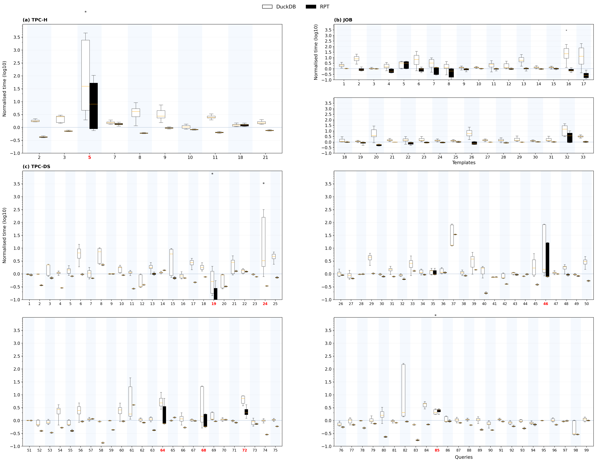\~75% 分位数（橙色线条为中位数），水平横线表示去除异常值后的最大值与最小值。\* 符号代表查询超时，循环类查询以红色标注。" title=" =1553x1206" />

表 4.2 左深连接的鲁棒性因子

 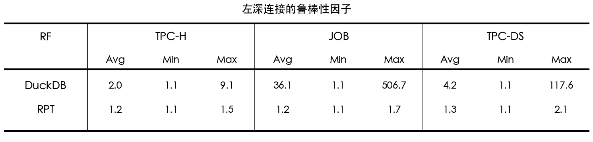

图 4.2 展示了JOB和TPCDS中部分查询的性能对⽐。与论文中结果存在出入的地方是：**本次复现中，PT、RPT在这些查询中均保持了较优秀的鲁棒性**，而在论文实验中，PT展现了较差的鲁棒性，RPT保持了较优秀的鲁棒性。

 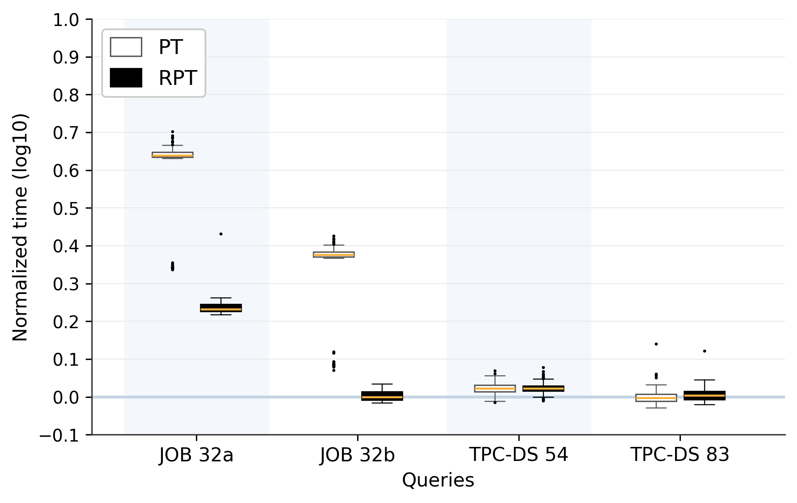

图 4.3 展示了随机丛状计划下的端到端执⾏时间分布，鲁棒性因⼦汇总于表 4.3 。结果显示，采⽤丛状计划时，RPT对随机连接顺序的鲁棒性与左深计划相近：平均鲁棒性因⼦$RF≈1.8$ ，最差情况为JOB的Query 16b（$RF = 9.64$ ）。

 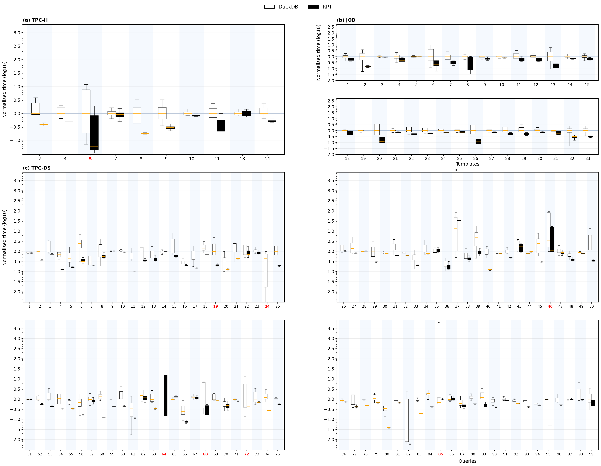

表 4.3 丛生连接的鲁棒性因子

 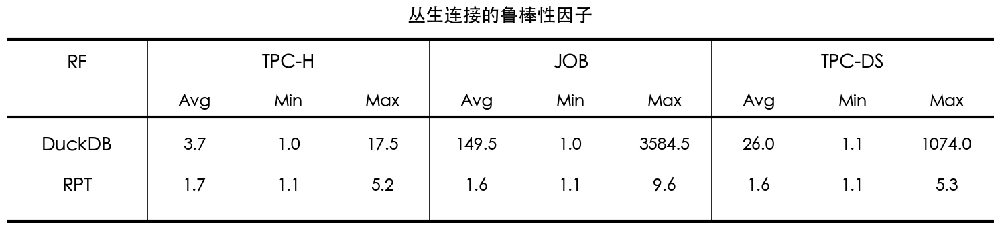

#### (2) 多线程执行的鲁棒性

我们采⽤16线程重复随机左深计划实验，以探究多线程执对RPT 鲁棒性的影响。如图 4.4 所示，RPT仍展现出较优秀的鲁棒性。

 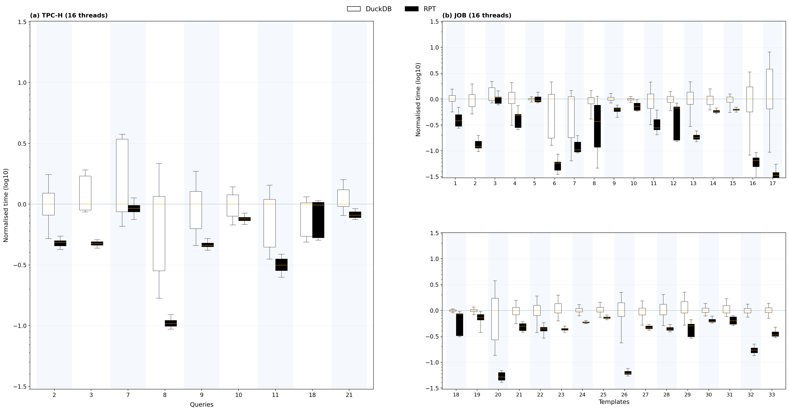

表 4.4 列出了RPT相对于原⽣DuckDB默认优化器计划(即 $t_{opt}$)的平均加速⽐，同时纳⼊布隆连接(Bloom Join)和原始谓词传递(PT)作为参考 。

结果显示，除鲁棒性保证外，RPT还能使单查询平均执⾏时间降低约 1.3 倍（⼏何均值）；布隆连接仅实现微弱的性能提升，且⽆法改善连接顺序鲁棒性 ；得益于LargestRoot算法，RPT在TPC-DS和DSB中的性能优于原始PT。

表 4.4 相对DuckDB（优化器原生执行计划）的平均加速比

 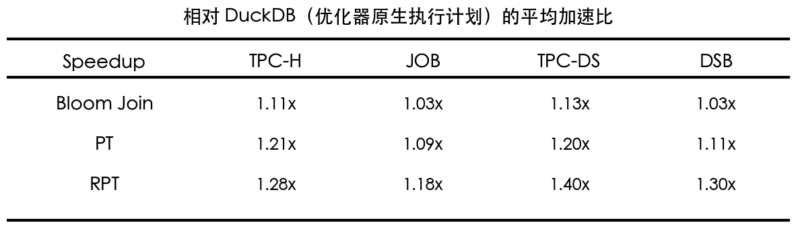

### 4.1.4 问题记录

#### (1) 大规模数据集导致内存与磁盘溢出（OOM/OOD）

* **现象**：在测试 `rpt_bushy_tpch_sf10` 的 Query 5 时，中间结果从内存溢出并持续写入磁盘，最终将磁盘占满，导致测试程序被迫终止，甚至引发服务器死机。
* **解决办法**：放弃使用 Scale Factor = 10 的数据集，改用规模更小的数据集（SF=1）进行测试，`rpt_left_sf1` 和 `rpt_bushy_sf1` 均可正常跑通。对于后续在随机丛生计划（bushy）下原生 DuckDB 处理 JOB 数据集 q56-q59 仍然崩溃的情况（即使限制内存和禁用磁盘溢写），采取**直接跳过崩溃查询**的策略。

#### (2) 长耗时测试任务异常中断

* **现象**：`duckdb_left_job` 等测试耗时极长（24小时以上），且期间因为本机与服务器网络连接断开或服务器宕机，导致测试进度中断。
* **解决办法**：将一次长测试细分为多次短测试，分批次观察测试进度。

## 4.2 Quorion(Yannak+) 复现记录

**gitlab链接**：[http://tprd-gitlab.dameng.com/zxw/quorion](http://tprd-gitlab.dameng.com/zxw/quorion)

### 4.2.1 实验环境

* Java JDK 1.8
* Scala 2.12.10
* Maven 3.8.6
* Python 版本 >= 3.9
* Python 依赖包：docopt、requests、flask、openpyxl、pandas、matplotlib、numpy

实验使用的硬件配置与系统环境如表 4.5 所示。

表 4.5 硬件配置与系统环境

| 实验环境 | 论文使用                                                  | 复现使用                                    |
| -------- | --------------------------------------------------------- | ------------------------------------------- |
| CPU      | Intel Xeon Gold 6354 CPU @ 3.00GHz (36 cores, 72 threads) | Intel® Core™ i9 processor 14900K @ 3.2GHz |
| 内存     | 1TB RAM                                                   | 128GB DDR5 RAM                              |
| 系统     | Ubuntu 20.04                                              | ubuntu 22.04                                |
| 集成系统 | DuckDB 1.0.0                                              | DuckDB 1.4.4                                |

#### (1) 安装依赖项

```bash
# 安装Java JDK 1.8
sudo apt update
sudo apt install openjdk-8-jdk -y
# 验证安装
java -version


# 安装 Scala 2.12.10
wget https://www.scala-lang.org/files/archive/scala-2.12.10.tgz
# 解压到 /usr/local
sudo tar -xvf scala-2.12.10.tgz -C /usr/local/
# 配置环境变量 (建议添加到 ~/.bashrc)
echo 'export SCALA_HOME=/usr/local/scala-2.12.10' >> ~/.bashrc
echo 'export PATH=$SCALA_HOME/bin:$PATH' >> ~/.bashrc
source ~/.bashrc
# 验证安装
scala -version


# 安装 Maven 3.8.6
wget https://archive.apache.org/dist/maven/maven-3/3.8.6/binaries/apache-maven-3.8.6-bin.tar.gz
# 解压到 /usr/local
sudo tar -xvf apache-maven-3.8.6-bin.tar.gz -C /usr/local/
# 配置环境变量
echo 'export MAVEN_HOME=/usr/local/apache-maven-3.8.6' >> ~/.bashrc
echo 'export PATH=$MAVEN_HOME/bin:$PATH' >> ~/.bashrc
source ~/.bashrc
# 验证安装
mvn -v


# 创建 Python 3.9 环境(以conda为例)
conda create -n quorion python=3.9 -y
# 激活环境
conda activate quorion
# 安装python依赖
conda install docopt requests flask openpyxl pandas matplotlib numpy
```

#### (2) 准备数据集

本实验用到以下四类数据集：

* Graph
* [LSQB](https://github.com/ldbc/lsqb)
* [TPC-H](https://www.tpc.org/tpc_documents_current_versions/current_specifications5.asp)
* JOB

Quorion源代码中提供了下载graph、JOB数据集的脚本。

```none
Quorion/scripts/download_graph.sh
Quorion/scripts/download_job.sh
```

其他数据集从相应官网下载生成代码自行生成数据。其中，JOB数据集是parquet的格式。

### 4.2.2 测试流程

#### (1) 加载数据

1. 确保已将数据放到 `Quorion/Data/[graph|lsqb|tpch|job]`
2. 运行脚本批量替换加载 SQL 中的默认路径：

```shell
$ bash scripts/update_paths.sh
```

（脚本见 scripts/update_paths.sh）

3. 复制配置模板并重命名为配置文件：将 query/config.properties.template 复制为 `query/config.properties`，并在其中填写 PostgreSQL 与 DuckDB 的配置
4. 使用以下脚本把数据加载到 DuckDB 和 PostgreSQL：

```shell
$ bash scripts/load_data_duckdb.sh
$ bash scripts/load_data_pg.sh
```

（脚本见 scripts/load_data_duckdb.sh、scripts/load_data_pg.sh）

#### (2) 生成重写后的查询

**选项 1：直接使用已生成的重写查询**

* 直接跳到 Step5

**选项 2：自行生成重写查询**

1. 构建 jar：

```shell
$ git submodule init
$ git submodule update
$ cd SparkSQLPlus
$ mvn clean package
$ cp sqlplus-web/target/sparksql-plus-web-jar-with-dependencies.jar ../
```

2. 修改 Parser 配置（位于 `query/config.properties`）
3. 启动 parser：

```shell
$ bash ./scripts/start_parser.sh
```

（脚本见 scripts/start_parser.sh）

4. 运行 main.py 启动 Python 后端重写组件：

```shell
$ python main.py
```

5. 生成符合 DuckDB SQL 语法的重写查询：

```shell
./auto_rewrite.sh graph graph_duckdb D N
./auto_rewrite.sh graph graph_pg M N
./auto_rewrite.sh lsqb lsqb D N
./auto_rewrite.sh tpch tpch D N
./auto_rewrite.sh job job D N
```

（脚本见 auto_rewrite.sh）

#### (3) 运行实验

**直接使用准备好的重写查询**

1. 修改 `query/config.properties` 中的规格参数。实验默认重复 5 次、超时 7200 秒
2. 运行批处理脚本执行全部 DuckDB 或 PostgreSQL 实验；也可以分别跑不同 benchmark：

```shell
$ ./auto_run_duckdb_batch.sh
$ ./auto_run_pg_batch.sh
    or
# Run DuckDB
$ ./auto_run_duckdb.sh graph graph_duckdb
$ ./auto_run_duckdb.sh lsqb lsqb
$ ./auto_run_duckdb.sh tpch tpch
$ ./auto_run_duckdb.sh job job
# Run PG
$ ./auto_run_pg.sh graph_pg
$ ./auto_run_pg.sh lsqb
$ ./auto_run_pg.sh tpch
$ ./auto_run_pg.sh job
```

3. 并行度、规模（scale）与选择率（selectivity）测试用的查询位于 `query` 目录下：

* 并行度测试：查询位于 `query/parallelism_[lsqb|sgpb]`，并行度通过以下参数设置：

```shell
./auto_run_duckdb.sh parallelism_[lsqb|sgpb] [1|2|4|8|16|32|48]
```

* 规模测试：查询位于 `query/scale_[job|lsqb]`
* 选择率测试：查询位于 `query/selectivity_[lsqb|tpch]`

#### (4) 汇总数据及绘图

1. 运行以下命令汇总统计信息，生成文件为 `summary_*_statistics[_default].csv`：

```shell
# Gather results for query under directory graph & lsqb & tpch & job
./auto_summary.sh graph
./auto_summary.sh graph
./auto_summary.sh tpch
./auto_summary_job.sh job
```

2. 运行 `draw/*` 下脚本绘图，输出 PDF 位于 `draw/*.pdf`：

```shell
# Generate pictures(graph.pdf, lsqb.pdf, tpch.pdf) about running times for SGPB, LSQB and TPCH. Corresponding to Figure 9. 
python3 draw_graph.py

# Generate pictures(job_duckdb.pdf, job_postgresql.pdf) about running times for JOB. Corresponding to Figure 10. 
python3 draw_job.py

# Generate picture(selectivity_scale.pdf) about selectivity & scale. Corresponding to Figure 11. 
python3 draw_selectivity.py

# Generate pictures(thread1.pdf, thread2.pdf) about parallelism. Corresponding to Figure 12.
python3 draw_thread.py
```

### 4.2.3 复现结果

> **结论：**
>
> 1. 在SGPB 和 LSQB 基准测试集上，复现结果与论文所述**基本一致**。重写器在DuckDB上显著提升了SGPB基准测试的性能，排除掉执行异常的查询后，DuckDB上的最⼤加速⽐46460倍，平均4287倍。重写器为LSQB基准测试带来⼤幅加速，DuckDB上最⼤加速⽐2282倍，平均267倍。
> 2. 在 TPC-H 基准测试集上出现了**较大程度的性能倒退**。论文中的最大倒退仅 12.75%，复现最大倒退达 416%。但论文也说明了 TPC-H 中 Yannak+ 重写开销高——复现数据印证了这一方向，只是程度远超论文结果。
> 3. 在 JOB 基准测试集上， 论文中实验的平均加速比为 1.42，本次复现实验的平均加速比为 1.20 且 56.6% 的查询存在性能倒退。
> 4. 在并行度方面，新查询计划与原⽣查询计划类似，随着线程数量增加，性能也会提升，说明新计划**具备良好的并⾏性**。

> 注：
> 1. 由于Yannak+重写查询在DuckDB v1.0.0 上存在较多无法执行查询，故复现所使用的DuckDB版本是1.4.4，论文中所使用的是1.0.0。
> 2. 由于硬件限制，复现使用规模因子为3的LSQB数据集(论文中使用30)，规模因子为1的TPC-H(论文中使用100)。
> 3. 图4-2-1：DuckDB的运行耗时，graph中的q5a_epinions、q7的DuckDBnative运行超时，q7 Yannak+重写sql执行异常；lsqb中的q2 DuckDBYannakakis执行异常。

图 4.5  展示了查询重写器在SGPB、LSQB、TPC-H 三个基准测试中，于 DuckDB上的运⾏时间。 所有触及坐标轴边界的柱形和缺失的部分表示系统超时或执行异常。

实验结果显示，原始 Yannakakis 算法在无 PK-FK 约束、多对多连接的复杂查询(SGPB/LSQB)的大部分场景中比原生计划明显更快，体现理论优势；**在标准 PK-FK 约束的常规查询(TPC-H)性能反而倒退**，隐藏常数过大的缺陷完全暴露，验证了经典 Yannakakis 无法在工业引擎落地的原因。

相比之下，Yannakakis + 改进算法对比原生计划，在绝大多数场景下大幅降低耗时；对比原始 Yannakakis，在部分基准(SGPB、LSQB)下性能更优，部分基准(TPC-H、JOB)的较大范围查询中出现耗时增加的情况。

 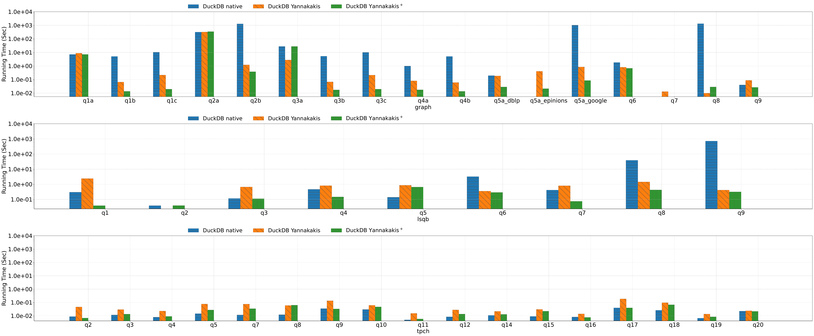

图 4.6 展示了查询重写器在JOB 基准测试中，于DuckDB上的加速比。

本次复现中Yannak+和Yannak81相比原生DuckDB存在较大范围的性能倒退，但Yannak+在JOB基准测试集的所有查询**均优于**Yannak81。

 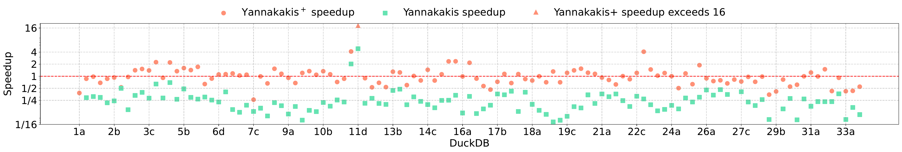

图 4.7 展示了在TPCH和LSQB上，DuckDB在不同选择度下的运行耗时。选取两个查询，通过修改谓词改变全连接规模F。图中横轴表示输出规模占⽆谓词时输出规模的百分⽐，可观察到在LSQB数据集上，**随着输出规模增⼤，重写器相⽐原⽣查询执⾏的优势愈发明显**。

 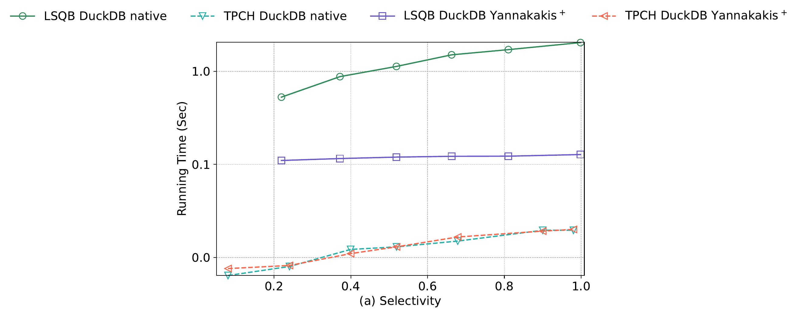

图 4.8 展现在特定查询(LSQB q1、SGPB q1)，不同并行度下重写查询器在DuckDB上的运行耗时。

实验结果表明新查询计划与原生查询计划在**并行度上的趋势保持一致**。

 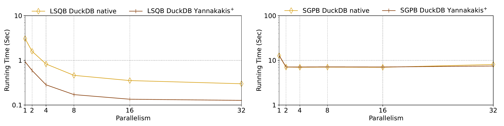

### 4.2.4 问题记录

#### (1) 多列IN在DuckDB 1.0.0 中不能被执行

* **原因**：DuckDB 1.0.0 不支持多列IN语法。
* **解决办法**：即使论文中实验所使用的DuckDB版本为 1.0.0 ，但Quorion(Yannakakis-Plus算法)重写后的sql语句包含该版本不支持的语法，故使用高版本DuckDB(DuckDB 1.4.4)。

#### (2) Quorion 生成的 SQL 语法与 DuckDB 不兼容

* **现象**：在测试 LSQB 数据集的 q1 时，Quorion 生成的 SQL 语句对关键字使用了反引号包裹（如 `` `Comment` ``），这在 DuckDB 中不被支持。
* **解决办法**：手动修改 `lsqb/q1/query.sql`，将所有的反引号替换为标准的双引号（即 `"Comment"`）。

#### (3) RewriteSQL末尾空行与测试脚本不兼容

* **现象**：在第测试中，四种数据集大量 SQL 报错如下 `Parser Error: syntax error at or near ")" LINE 2: ) TO '/dev/null' (DELIMITER ',');`。
* **解决办法**：撰写脚本删除sql文件末尾空行。

## 4.3 RPT 源码分析

RPT整体流程图如图 4.9 所示。

 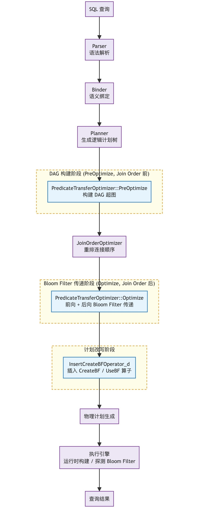

### 4.3.1 入口：在优化器管道中的位置

RPT 集成在 DuckDB 的优化器管道中（optimizer.cpp:124-138），通过两个钩子函数在 **join order 优化的前后** 分阶段执行。当宏 `PredicateTransfer` 启用时生效：

(1) **PreOptimize 阶段** 在 `DELIMINATOR` 之后，`JOIN_ORDER` 之前执行，通过 `PT.PreOptimize(plan)`构建DAG超图。

(2) **Optimize 阶段** 在 `JOIN_ORDER` 之后执行，通过 `PT.Optimize(plan)`把 `CreateBF` / `UseBF` 算子插入到逻辑计划。

### 4.3.2 PreOptimize —— DAG 构建

`PreOptimize` 入口函数在 predicate_transfer_optimizer.cpp:30。它只做一件事：调用 `dag_manager.Build(*plan)`，接收逻辑计划树，构建 DAG 超图后原样返回 plan。

`DAGManager::Build` 的执行步骤（dag_manager.cpp:14）：

#### (1) 节点提取：`NodesManager::ExtractNodes`

递归遍历逻辑计划树，识别并收集以下类型的算子作为 DAG 的**顶点** ：`LOGICAL_GET` / `LOGICAL_DELIM_GET` / `LOGICAL_PROJECTION` / `UNION` / `EXCEPT` / `INTERSECT` / `LOGICAL_FILTER` / `LOGICAL_AGGREGATE_AND_GROUP_BY` / `LOGICAL_WINDOW` / `LOGICAL_DUMMY_SCAN` / `LOGICAL_EXPRESSION_GET` 。

同时，遇到 `LOGICAL_COMPARISON_JOIN` 时，如果存在 **等值连接条件** （`COMPARE_EQUAL` 且左右都是 `BOUND_COLUMN_REF`），则将该 Join 算子推入 `filter_operators` 列表。对于非等值 Join（如 `NOT EXISTS`）会设置 `can_add_mark = false` 跳过后续处理。

**列重命名处理** ：Projection 和 Aggregate 的 Group By 列会被记录到 `rename_cols` 映射中，用于后续跨层列绑定的追溯。

#### (2) 节点备份与排序

* `DuplicateNodes` ：将当前节点列表备份到 `duplicate_nodes`。后续 DAG 构建中会删除/修改节点，最终通过备份恢复完整的节点映射。
* `SortNodes` ：按 `estimated_cardinality`（估计基数）升序排序，得到 `sort_nodes` 列表。基数小的排在前面，基数大的排在后面。
* **节点数不足 2 时提前退出**，不执行后续优化。

#### (3) 边提取：`ExtractEdges`

从 `filter_operators`（即 Join 算子）中提取等值连接条件，构造 DAG 的 **超边** ：

1. 遍历每个 Join 的 `conditions`，跳过非等值条件
2. 确定连接两侧的 `table_id`（left_table / right_table）
3. 根据基数排序确定 **large**（基数大的节点）和 **small**（基数小的节点）
4. 根据 `JoinType` 设置保护标志：
   * `INNER` / `SEMI` / `RIGHT_SEMI` / `MARK`：`large_protect=false, small_protect=false`（双向传递）
   * `LEFT JOIN`：`large_protect=true`（限制单向，保护外连接语义）
   * `RIGHT JOIN`：`small_protect=true`（限制单向，保护外连接语义）
5. 以 `(small_table_id, large_table_id)` 和 `(large_table_id, small_table_id)` 两个 key 存入 `filters_and_bindings_`

#### (4) DAG 构建策略：`CreateDAG`

RPT策略（`LargestRoot`）在 [dag_manager.cpp:245](vscode-webview://05efmki93m9nrs9s2j9t3eoi3c70qpc36s9v5cfvjkkrft77f480/Robust-Predicate-Transfer/src/optimizer/predicate_transfer/dag_manager.cpp#L245)：

1. 选择 `sorted_nodes.back()`（基数最大的节点）作为根节点（root），加入 `constructed_set`
2. 将根加入 `ExecOrder`，设置最高 `priority`（= N-1）
3. 循环调用 `FindEdge`：在 `constructed_set`（已构建）和 `unconstructed_set`（未构建）之间找到**权重最大的边**（权重 = 等值条件数量；权重相同时选基数大的节点）
4. 将新节点加入 `constructed_set`、从 `unconstructed_set` 移除、加入 `ExecOrder`、设置 `priority`（递减）
5. 直到 `unconstructed_set` 为空或无可用边
6. **循环处理**：如果仍有剩余节点（未连接到根），`CreateDAG()` 会再次调用 `LargestRoot` 处理新的连通分量（[dag_manager.cpp:366-372](vscode-webview://05efmki93m9nrs9s2j9t3eoi3c70qpc36s9v5cfvjkkrft77f480/Robust-Predicate-Transfer/src/optimizer/predicate_transfer/dag_manager.cpp#L366-L372)）

#### (5) 连接 DAG 节点

遍历 `selected_filters_and_bindings_`，根据 `large_protect` / `small_protect` 和节点优先级，调用 `DAGNode::AddIn` / `AddOut` 连接边：

* **无保护**（INNER / SEMI 等）：`forward_in_` / `forward_out_` / `backward_in_` / `backward_out_` 四个方向全连
* **large_protect**（LEFT JOIN 且左表为 large 时）：只连 `forward` 方向
* **small_protect**（RIGHT JOIN 且右表为 small 时）：只连 `backward` 方向

### 4.3.3 Optimize ——Bloom Filter 传递

`Optimize` 入口函数在 predicate_transfer_optimizer.cpp:37。

#### (1) 前向传递（Forward：高优先级 → 低优先级）

```cpp
for (int i = ordered_nodes.size() - 1; i >= 0; i--)  // 从 ExecOrder 末尾（根/高优先级）到开头（低优先级）
    auto BFvec = CreatBloom FilterFilter(*current_node, false);  // reverse = false
    dag_manager.Add(BF.first, BF.second, false);
```

按 `ExecOrder` **从后向前** 遍历（即从根节点/高优先级到叶节点/低优先级）。对每个节点调用 `CreatBloom FilterFilter(node, false)`：

1. `GetNodeId` ：获取当前节点的 `table_id`，如果不在 DAG 中则跳过
2. `GetAllBFUsed` ：遍历 `forward_in_` 边，收集从高优先级节点传来的、尚未标记为 `isUsed` 的Bloom Filter，标记为已使用
3. `GetAllBFCreate` ：遍历 `forward_out_` 边，从 filter 表达式中提取列绑定（`column_bindings_built` = 本表需要构建的列，`column_bindings_applied` = 对端需要应用的列）
4. 根据"创建/使用"的组合分三种情况：
   * **只创建不消费**（`BFvec.used.empty()` 且 `!BFvec.to_create.empty()`）：调用 `BuildSingleCreateOperator`，生成 `LogicalCreateBF`，存入 `replace_map_forward`
   * **只消费不创建**（`!BFvec.used.empty()` 且 `BFvec.to_create.empty()`）：调用 `BuildUseOperator`，生成嵌套的 `LogicalUseBF` 链（每个 UseBF 关联一个 CreateBF），存入 `replace_map_forward`
   * **既消费又创建**（两者均非空）：调用 `BuildCreateUsePair`，生成 `LogicalCreateBF` 包裹 `LogicalUseBF` 链，存入 `replace_map_forward`

> **前向的含义**：沿着 LargestRoot 构建的 DAG，从根节点（高优先级）向外传播谓词，利用已连接的高优先级节点的 BF 过滤低优先级节点。

#### (2) 后向传递（Backward：低优先级 → 高优先级）

```cpp
for (int i = 0; i < ordered_nodes.size(); i++)  // 从 ExecOrder 开头（低优先级）到末尾（根/高优先级）
    auto BFvec = CreatBloom FilterFilter(*current_node, true);  // reverse = true
    dag_manager.Add(BF.first, BF.second, true);
```

按 `ExecOrder` **从前向后** 遍历。逻辑与前向相同，但 `reverse = true`：

* `GetAllBFUsed` 遍历 `backward_in_`（从低优先级节点传来的 BF）
* `GetAllBFCreate` 遍历 `backward_out_`（传给高优先级节点的 BF）
* 结果存入 `replace_map_backward`

> **后向的意义**：低优先级节点通常连接性强、过滤后行数更少，其 BF 选择性更好。将谓词传回高优先级节点（如根节点），可以在根表扫描阶段就提前过滤掉不可能参与连接的行。

#### (3) 算子插入：`InsertCreateBFOperator_d`

递归遍历逻辑计划树（[predicate_transfer_optimizer.cpp:352](vscode-webview://05efmki93m9nrs9s2j9t3eoi3c70qpc36s9v5cfvjkkrft77f480/Robust-Predicate-Transfer/src/optimizer/predicate_transfer/predicate_transfer_optimizer.cpp#L352)）：

1. 先递归处理所有子节点
2. 检查当前节点是否在 `replace_map_forward` 中：如果在，获取 BF 算子链，遍历到链的最底层（叶子节点），将原 plan 作为叶子节点挂载，返回 BF 算子链替换原节点
3. 检查当前节点是否在 `replace_map_backward` 中：同上逻辑，在 `forward` 替换的结果上再做 `backward` 替换

最终算子链结构为（从顶到底）：
```txt
LogicalUseBF(backward)          ← Backward 方向探测，用低优先级节点的 BF 过滤当前节点
  └─ LogicalCreateBF(backward)  ← Backward 方向构建过滤器，为本表构建传给更高优先级节点的 BF
      └─ LogicalUseBF(forward)  ← Forward 方向探测，用高优先级节点的 BF 过滤当前节点
          └─ LogicalCreateBF(forward)  ← Forward 方向构建过滤器，为本表构建传给更低优先级节点的 BF
              └─ 原算子
```

### 4.3.4 运行时Bloom Filter 的构建与探测

#### (1) BF 构建Bloom FilterFilterBuilder_SingleThreaded）

入口Bloom Filter_filter.cpp:268：

1. `Begin` ：根据预估行数计算 BF 大小

* `min_bits_per_key = 8`（每个 key 至少 8 bit）
* `min_num_bits = 512`（最小 512 bit）
* `num_blocks = 2^(log_bits - 6)`，分配并清零 bit vector

2. `PushNextBatch` ：对每批 hash 值调用 `Insert`

* 优先使用 `Insert_avx2`（AVX2 SIMD 批量插入）
* 回退到 `InsertImp`（逐条插入）

3. `Fold` （折叠优化）：如果已设置位 < 总量的 1/4，通过 `SingleFold`（OR 合并对称半区）将 BF 缩小一半，重复直到无法缩小

#### (2) 并行构建Bloom FilterFilterBuilder_Parallel）

入口Bloom Filter_filter.cpp:296：

1. 按 hash 值高位分区：`log_partitions = min(8, Log2(threads))`
2. 每个分区内的 hash 值排序到连续内存（`PartitionSort`）
3. 各线程独立对各自分区执行 `Insert`，无需加锁（分区保证不同线程操作不同 block）
4. 最终 `CleanUp` / `Merge`

#### (3) BF 探测（BlockeBloom FilterFilter::Find）

入口Bloom Filter_filter.cpp:163：

1. 如果启用 AVX2 且未开启预取：调用 `Find_avx2` SIMD 批量探测，输出结果位向量
2. 否则调用 `FindImp` 逐条探测
3. `FindImp` 可选启用预取：提前 16 个迭代预取 `blocks[i + kPrefetchIterations]`，减少 cache miss
4. 结果通过 `basic_decoder` 解码：`trailingzeroes` 找最低位 + `popcount`（`bits & (bits-1)`）清除已处理位，输出 `SelectionVector`（匹配行索引数组）

#### (4) Pipeline 依赖机制

`PhysicalCreateBF` 同时实现 **Sink** 和 **Source** 接口，通过 `BuildPipelines` 建立管道依赖：

1. **Sink 管道**：消费子算子数据 → `Sink()` 累积到本地集合 → `Combine()` 合并到全局 → `Finalize()` 触发 BF 构建
2. **Source 管道**：BF 构建完成后，`GetData()` 从 `total_data` 中产出原始数据
3. **UseBF 管道**：`PhysicalUseBF::BuildPipelines()` 遍历 `related_create_bf`，调用 `BuildPipelinesFromRelated()` 建立依赖边，**确保 UseBF 所在管道在对应 CreateBF 完成后才执行**

执行顺序保证：

```txt
CreateBF.Sink(收集数据) → CreateBF.Finalize(构建BF) → CreateBF.Source(产出数据) → UseBF.Execute(探测过滤)
```

## 4.4 Yannak+ 源码分析

Yannak+整体流程图如图 4.10 所示。

 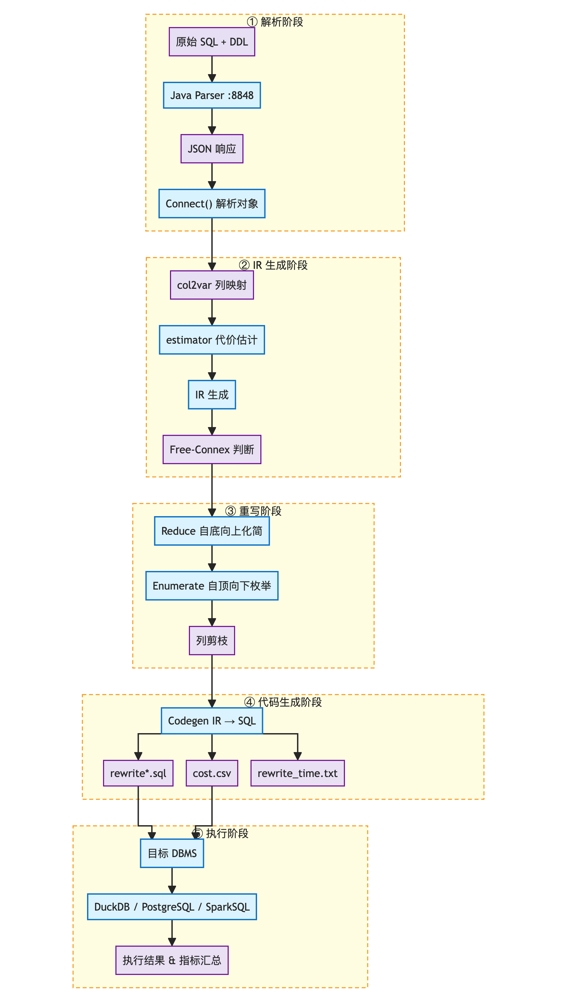

\

### 4.4.1 解析 SQL

**入口** ：main.py 的 `connect()` 函数（或 `connectJava()`）

1. **输入** ：用户提供原始 SQL 查询（`query.sql`）和 DDL 定义文件（如 `lsqb.ddl`）。
2. **Java 解析器** ：系统通过 HTTP 请求调用 Java 解析器（`sparksql-plus-web-jar-with-dependencies.jar`，监听在 `localhost:8848`），解析器在端口 8848 的 `/api/v1/parse` 接口上接收 DDL + Query。
3. **解析器输出** ：Java 解析器将 SQL 解析为结构化的 JSON 响应，包含以下关键信息：
* `tables` ：表名及其列的映射（`table2vars`）
* `joinTrees` ：一棵或多棵 JoinTree（连接树），每棵树包含节点（nodes）、边（edges）、根节点（root）、输出子集（subset）、比较条件（comparisons）等
* `outputVariables` ：查询的输出变量列表
* `groupByVariables` ：GROUP BY 变量
* `aggregations` ：聚合函数信息（func、result、args）
* `topK` ：Top-K 排序信息（orderByVariable、desc、limit）
* `computations` ：计算表达式（如 EXTRACT 等）
* `full` ：是否是完全查询（full query）
* `fixRoot` ：是否固定根节点

4. **Fallback** ：如果解析失败（返回 `fallback`），系统直接输出原始查询，不做重写。

### 4.4.2 IR 构建

**入口** ：main.py 的 `connect()` 函数内部，以及 treenode.py、jointree.py

1. **节点解析** ：根据解析器返回的节点类型，创建不同类型的树节点：

* `TableTreeNode` ：普通表扫描节点
* `AuxTreeNode` ：辅助关系节点（AuxiliaryRelation），依赖于支撑关系（support relation）
* `BagTreeNode` ：包关系节点（BagRelation），内部包含多个子节点（如子查询、IN 列表）
* `TableAggTreeNode` ：表扫描+聚合混合节点
* `AggTreeNode` ：纯聚合节点

2. **列到变量的映射** ：通过 `parse_col2var()` 函数，将每个节点的列名映射到原始数据库的列名（`col2vars`），这对于后续生成正确的 SQL 别名至关重要。
3. **构建 JoinTree** ：

* 将节点通过边（`Edge`）连接成树结构，边有方向（parent → child）和类型（Child/Parent/Both/No）
* 设置根节点（`setRootById`）
* 判断是否为 Free-Connex 查询（`isFreeConnex`）：如果输出变量不等于 subset 中的列，则不是 Free-Connex
* 解析比较条件（`Comparison`），包括比较操作符（`<`, `>`, `<=`, `>=`）、路径（path，表示经过哪些节点的比较）、左/右表达式

4. **聚合与 TopK 构建** ：

* 如果有聚合函数，创建 `Aggregation` 对象
* 如果有 Top-K 需求，创建 `TopK` 对象（支持 Level-K 和 Product-K 两种模式）

### 4.4.3 代价估算与 JoinTree 选择

**入口** ：estimator.py的 `getEstimation()` 和 `cal_cost()`

1. **统计信息加载** ：从 Excel 文件（如 `lsqb.xlsx`）中读取每张表的基数（cardinality）和不同值数量（NDV）。
2. **代价计算** ：对每棵 JoinTree：
* 计算树的高度（`cost_height` = root.depth）
* 计算最大扇出（`cost_fanout` = root.fanout）
* 估算中间结果大小（`cost_estimate`）：自底向上遍历树，对每个节点的每个子节点，根据 NDV 和基数估算连接后的中间结果大小：`inter_size = min_ndv * child.estimateSize / child.statistics[1] * node.estimateSize / node.statisticsC[1]`
* 最终代价 = `join_cost * view_cost`

3. **选择最优 JoinTree** ：系统维护一个优先队列，选择最多 8 棵代价最低的 JoinTree（fixRoot 和非 fixRoot 各占一半）进行后续重写。

### 4.4.4 IR 生成

这是 Quorion 最核心的阶段，分为 **Reduce（缩减）** 和 **Enumerate（枚举）** 两个子阶段。

**入口** ：generateIR.py() 的 `generateIR()` 函数

#### (1) Reduce 阶段（自底向上缩减）

**目标** ：将 JoinTree 从叶子节点开始，逐层向上缩减，直到只剩根节点。

1. **选择待缩减的边** ：

* 优先选择叶子节点的边（`getLeafRelation`）
* 如果存在支撑关系（support relation，即 AuxiliaryRelation 的依赖），优先处理（`getSupportRelation`）

2. **确定缩减方向** ：

* 检查该边关联的比较条件（`getCompRelation`）
* 如果比较条件的起点在子节点侧，则方向为  **Left** （从左向右缩减）
* 如果比较条件的终点在子节点侧，则方向为 **Right**
* 如果没有比较条件，则使用 **SemiJoin** 模式

3. **构建 ReducePhase** （`buildReducePhase`），根据节点类型和缩减方向生成不同的视图：

* **PrepareView** ：为特殊节点类型（Bag、TableAgg、Aux）创建预备视图
  * `CreateBagView`：将 Bag 内部的多表连接合并为一个视图
  * `CreateAuxView`：为辅助关系创建支撑视图
  * `CreateTableAggView`：为表聚合关系创建聚合视图
* **OrderView** （`CreateOrderView`）：当存在比较条件时，使用 `row_number()` 窗口函数对子节点按比较列排序分区
* **MinView** （`SelectMinAttr`）：在排序结果中选择最小/最大 rn=1 的记录，实现 CQC（Comparison Query Compression）
* **JoinView** （`Join2tables`）：将父节点与 MinView 的结果连接
* **SemiView** （`SemiJoin`）：当没有比较条件时，使用半连接（`IN` 子查询）替代普通连接

4. **更新 JoinTree** ：移除已处理的边，更新比较条件的路径，将生成的 ReducePhase 附加到对应的树节点上。
5. **循环执行** ：重复上述过程，直到 JoinTree 只剩一条边（即只剩根节点和最后一个子节点）。最后一条边的处理方式类似，但标记为 `lastRel=True` 以启用列选择优化。

#### (2) Enumerate 阶段（自顶向下枚举）

**目标** ：将 Reduce 阶段生成的结果按逆序重新连接起来，生成最终结果。

1. **确定枚举顺序** ：将 ReduceList 反转（从根到叶子的顺序），对于 Free-Connex 查询，只枚举 subset 中的节点。
2. **构建 EnumeratePhase** （`buildEnumeratePhase`），对每个对应的 ReducePhase 生成枚举视图：
* **SemiEnumerate** ：对应 SemiJoin 模式，将半连接的视图与原始表连接
* **CreateSample** ：从 OrderView 中采样
* **SelectMaxRn** ：选择最大行号
* **SelectTargetSource** ：选择目标源
* **StageEnd** ：将前一步的结果与当前节点连接，逐步构建最终结果

3. **聚合处理** ：在枚举过程中，如果涉及聚合，需要将 `annot`（注解/权重）相乘，并将聚合函数重新包装。

#### (3) 列剪枝（Column Pruning）

**入口** ：columnPrune.py 的 `columnPrune()`

生成最终的 `finalResult` SELECT 语句后，执行列剪枝优化：移除 Reduce 和 Enumerate 阶段中不需要的列，减少中间结果的大小。

### 4.4.5 SQL 生成

**入口** ：codegen.py的 `codeGen()` 函数

1. **按顺序生成 SQL 视图** ：

* 首先输出所有 `aggList` 中的聚合准备视图（AggReducePhase）
* 然后依次输出每个 `ReducePhase` 中的视图（PrepareView → OrderView → MinView → JoinView / SemiView → BagAuxView）
* 接着输出每个 `EnumeratePhase` 中的视图（SemiEnumerate / CreateSample → SelectMax → SelectTarget → StageEnd）
* 最后输出 `finalResult`（最终的 SELECT 语句）

2. **目标数据库适配** ：

* **DuckDB 模式** ：使用 `create or replace TEMP view` 语法，支持元组 IN 子查询 `IN (SELECT (a, b) FROM ...)`
* **MySQL 模式** ：使用不同的语法变体
* **PostgreSQL 模式** ：生成 PG 兼容的 SQL

3. **Yannakakis 模式** ：如果用户选择了 Yannakakis 算法（`--yanna Y`），则走 `yaGenerateIR()` + `codeGenYa()` 路径，使用传统的 Yannakakis 半连接算法而非 Quorion 的 CQC 优化。
4. **Top-K 模式** ：对于 Top-K 查询，使用 `generateTopKIR()` + `codeGenTopK()` 路径，支持 Level-K 和 Product-K 两种算法。

# 五、参考文献

1. **Yannakakis, M.** (1981). [Algorithms for Acyclic Database Schemes](http://tprd-outline.dameng.com/s/3848921f-db1a-4094-a568-cdf305b887a1#h-%E5%8F%8C%E8%AF%AD%E7%BF%BB%E8%AF%91). *VLDB 1981*.
2. **Wang, Q., Chen, B., Dai, B., Yi, K., Li, F., & Lin, L.** (2025). [Yannakakis+: Practical Acyclic Query Evaluation with Theoretical Guarantees](http://tprd-outline.dameng.com/s/3848921f-db1a-4094-a568-cdf305b887a1#h-%E8%AE%BA%E6%96%87%E5%8E%9F%E6%96%87-1). *SIGMOD 2025*.
3. **Yang, Y., Zhao, H., Yu, X., & Koutris, P.** (2024). [Predicate Transfer](http://tprd-outline.dameng.com/s/3848921f-db1a-4094-a568-cdf305b887a1#h-%E8%AE%BA%E6%96%87%E5%8E%9F%E6%96%87-2). *CIDR 2024*.
4. **Zhao, J., Su, K., Yang, Y., Yu, X., Koutris, P., & Zhang, H.** (2025). [Debunking the Myth of Join Ordering: Toward Robust SQL Analytics](http://tprd-outline.dameng.com/s/3848921f-db1a-4094-a568-cdf305b887a1#h-%E8%AE%BA%E6%96%87%E5%8E%9F%E6%96%87-3). *SIGMOD 2025*.
5. **Qiao, Y., Boncz, P., & Zhang, H.** (2025). [Robust Predicate Transfer with Dynamic Execution](http://tprd-outline.dameng.com/s/3848921f-db1a-4094-a568-cdf305b887a1#h-%E8%AE%BA%E6%96%87%E5%8E%9F%E6%96%87-4). *PVLDB 2025, Vol. 19, No. 6*.
6. **Zhao, H., Ding, B., Papadimos, V., Tian, Y., Bruno, N., et al.** (2026). [I Can&#39;t Believe It&#39;s Not Yannakakis](http://tprd-outline.dameng.com/s/3848921f-db1a-4094-a568-cdf305b887a1#h-%E8%AE%BA%E6%96%87%E5%8E%9F%E6%96%87-5). *CIDR 2026*.
7. **Quorion**: [PVLDB 2025 companion paper to Yannakakis+, focusing on SQL-level rewritability and GHD decomposition](http://tprd-outline.dameng.com/s/3848921f-db1a-4094-a568-cdf305b887a1#h-%E8%AE%BA%E6%96%87%E5%8E%9F%E6%96%87-6).

# 六、术语索引

| 术语                                          | 简要解释                                                                                                                                                        |
| --------------------------------------------- | --------------------------------------------------------------------------------------------------------------------------------------------------------------- |
| **无环/有环**                           | 连接关系能否被一棵 连接树 覆盖并保持"属性连通性"。无环时可沿树传播约束做强剪枝；有环时通常只能在局部结构上做近似的"树化/规约"，并需要接受边界条件或不确定性。   |
| **规约/预过滤**                         | 在真正做连接前，先删掉不可能参与最终结果的行。规约更强调结构性完备剪枝（例如 full reduction）；预过滤更偏工程实现（例如位图Bloom Filter 先挡掉明显无关行）。    |
| **近似过滤Bloom Filter/位图）**         | 一类"便宜但不完备"的预过滤：可能保留无关行（假阳性），但不应删掉会产生正确结果的行（不影响正确性）。常见实现是Bloom Filter 与位图过滤，用更小常数换取更弱保证。 |
| **鲁棒性**                              | 即便 join order 或选择性估计不理想，运行时间也不至于数量级崩塌的稳定性目标；常以"最差/最好运行时间比"等指标刻画。                                               |
| **回归（常数开销）**                    | 机制进入默认路径后，额外扫描/构建/位操作等固定开销可能把收益吃掉，导致部分查询变慢；RPT+ 等工作把"避免回归"作为显式目标。                                       |
| **无环查询 (Acyclic Query)**            | Join 图可以表示为连接树的查询，满足属性连通性条件                                                                                                               |
| **半连接 (Semi-join)**                  | 只过滤不生成新组合的连接操作，只保留能在另一表匹配到的行                                                                                                        |
| **悬挂元组 (Dangling Tuple)**           | 在局部连接中存在但无法参与全局连接的元组，会导致中间结果膨胀                                                                                                    |
| **完全约简 (Full Reduction)**           | 消除所有悬挂元组后的实例状态，每个元组都能参与全局连接                                                                                                          |
| **连接树**                              | 无环查询的树形表示，满足属性连通性条件                                                                                                                          |
| **GYO 消解**                            | 检测无环性并构造连接树的算法                                                                                                                                    |
| **Free-connex**                         | 无环查询投影后仍保持连通性的性质，保证线性复杂度                                                                                                                |
| **α-无环**                             | 最常用的无环性定义，存在连接树即满足                                                                                                                            |
| **隐藏常数 (Hidden Constant)**          | 理论复杂度分析不包含但实际执行中显著影响性能的固定开销                                                                                                          |
| **Bloom Filter**                        | 用于快速检测元素是否存在的概率数据结构，空间效率高但有假阳性                                                                                                    |
| **谓词传递 (Predicate Transfer)**       | Bloom Filterom将过滤信息沿Join 图多跳传播的技术                                                                                                                 |
| **最大生成树 (Maximum Spanning Tree)**  | RPT中用于构造连接树的方法，边权为共享属性数                                                                                                                     |
| **SafeSubjoin**                         | RPT中保证连接顺序安全性的检测方法，确保中间结果不超过输出规模                                                                                                   |
| **不对称传播计划 (ATP)**                | RPT+中前向收集后向分发的优化，减Bloom Filteroom构建                                                                                                             |
| **级联过滤 (Cascade Filter)**           | RPT+中min-maxBloom Filteroom精筛的层级过滤，适配列式存储row group                                                                                               |
| **位图前置过滤 (Bitmap Pre-filtering)** | SQL Srv：build 侧建位图、下推到下层扫描，先于 HJ 探测丢行；与论文/产品中的 bitmap filtering、prefilter 同义                                                     |
| **位图过滤 (Bitmap Filtering)**         | 与「位图前置过滤」同指 SQL Srv 所述机制时的产品/论文用语                                                                                                        |
| **拉取式级联 (基于拉取的 Cascade)**     | SQL Server中位图随递归next()调用自然下推的执行方式                                                                                                              |
| **半鲁棒性 (Semi-robust)**              | 有环Join 图上的稳定性概念，只要求少数关键中间结果可控                                                                                                           |
| **最坏情况最优连接 (WCOJ)**             | 一类保证最坏情况下时间复杂度不超过输出规模多项式的连接算法家族                                                                                                  |
